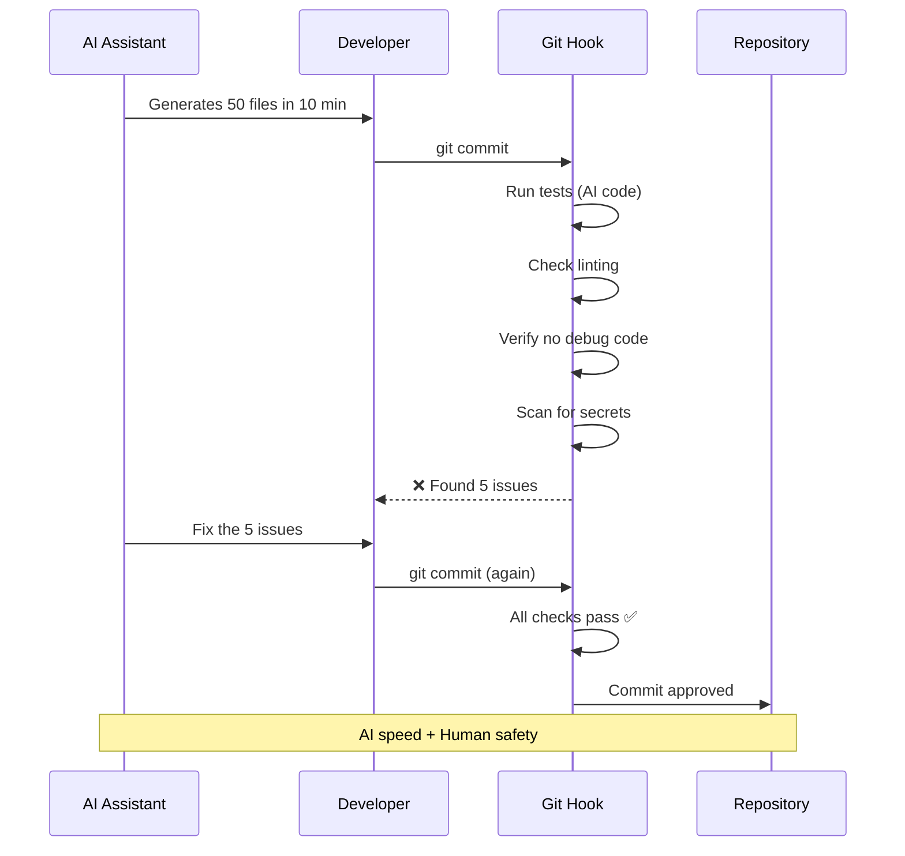

# AI Vibe Agents Are Code Spray Guns: Why You Need Git Hooks

## The 400 Files Per Hour Problem

AI coding assistants spray code like a firehose.

They generate:

- Entire features in minutes
- Comprehensive tests
- Beautiful documentation
- Refactored legacy code

**50 files in 10 minutes.**

The natural response:

```bash
git add .
git commit -m "AI generated awesome feature"
git push
```

**5 minutes later**: Production is down.

**What happened?**

- 15 files have bugs (AI misunderstood requirements)
- 10 files are experiments (AI was exploring options)
- 8 files have console.logs everywhere (AI debugging)
- 5 files break existing tests
- 3 files have hardcoded credentials (AI placeholder)

**Cost**: Thousands in downtime, emergency rollback, team panic.

**The problem**: AI can generate code at **superhuman speed**, but it can't judge what should **actually ship to production**.

<!--truncate-->

## Why AI Coding Makes This Worse

### Human Developers


**Human pace**: Slow enough to review everything

### AI Assistants


**AI pace**: Too fast for human review

## The AI-Specific Problems

### Problem 1: The Experiment Dump

AI assistants explore options:

```bash
# AI generates while experimenting:
approach_v1.ts
approach_v2.ts
approach_v3.ts
approach_v4_final.ts
approach_v5_actually_final.ts
approach_v6_no_really_this_one.ts
```

**You commit everything** because you're not sure which one the AI settled on.

**Result**: Repository full of dead code.

### Problem 2: The Debug Explosion

```typescript
// AI-generated file
export function calculateTotal(items: Item[]) {
  console.log('DEBUG: Starting calculation', items);
  console.log('DEBUG: Items length:', items.length);

  const total = items.reduce((sum, item) => {
    console.log('DEBUG: Processing item', item);
    console.log('DEBUG: Current sum', sum);
    return sum + item.price;
  }, 0);

  console.log('DEBUG: Final total', total);
  return total;
}
```

**You commit it** because the logic looks right.

**Result**: Production logs filled with debug spam.

### Problem 3: The Placeholder Panic

```typescript
// AI-generated config
export const config = {
  apiKey: 'TODO_REPLACE_WITH_ACTUAL_KEY',
  database: 'localhost:5432', // TODO: use environment variable
  secretKey: 'temporary-secret-123', // AI placeholder
};
```

**You commit it** because you'll "fix it later."

**Result**: Credentials in git history forever.

### Problem 4: The Over-Engineering

AI doesn't know your constraints:

```bash
# AI generates enterprise solution for simple problem:
src/
  auth/
    strategies/
      jwt/
        factory/
          builder/
            abstract-jwt-strategy-factory-builder.ts
            concrete-jwt-strategy-factory-builder.ts
        interfaces/
          jwt-strategy-interface.ts
    # ... 47 more files
```

**You commit it** because it looks "professional."

**Result**: Unmaintainable complexity.

## The Solution: Automated Safety Checks

Git hooks give AI assistants **guardrails at superhuman speed**.



**The magic**: AI generates at full speed, hooks ensure only production-ready code ships.

## Real-World AI + Hooks Workflow

### Without Hooks

```bash
# You: "Claude, implement user authentication"

# Claude generates:
✓ 50 files created
✓ Tests written
✓ Documentation added

# You (impressed):
git add .
git commit -m "AI: Add authentication"
git push

# 10 minutes later:
# ❌ Tests failing on CI
# ❌ Linter errors
# ❌ TypeScript errors
# ❌ Debug logs everywhere
# ❌ Hardcoded test credentials

# You spend next hour fixing AI's overeagerness
```

**AI productivity**: ⚡ Fast  
**Code quality**: ❌ Broken  
**Your time**: 🔥 Wasted fixing

### With Hooks

```bash
# You: "Claude, implement user authentication"

# Claude generates:
✓ 50 files created

# You:
git add .
git commit -m "AI: Add authentication"

# Pre-commit hook runs:
# Running tests... ❌ 3 tests failing
# Checking linter... ❌ 15 style issues
# Scanning for secrets... ❌ Found test credential
# Commit blocked

# You: "Claude, fix these 3 test failures and lint errors"

# Claude fixes them in 30 seconds

# You:
git commit -m "AI: Add authentication"

# Pre-commit hook:
# ✅ All tests pass
# ✅ Linting clean
# ✅ No secrets found
# ✅ Commit successful

git push
# Pre-push hook:
# ✅ Full test suite passes
# ✅ Build succeeds
# ✅ Push successful
```

**AI productivity**: ⚡ Fast  
**Code quality**: ✅ Guaranteed  
**Your time**: ✅ Saved

## The Safety Checks Every AI Needs

### Pre-Commit: Fast Validation

```bash
#!/bin/sh
# Block commits with common AI mistakes

# 1. No debug code
if git diff --cached | grep -E "console\.(log|debug|trace)" > /dev/null; then
  echo "❌ Found console.log in AI-generated code"
  exit 1
fi

# 2. No TODO placeholders
if git diff --cached | grep "TODO_REPLACE" > /dev/null; then
  echo "❌ Found AI placeholder that needs replacing"
  exit 1
fi

# 3. No hardcoded secrets
if git diff --cached | grep -E "(password|secret|key).*=.*['\"]" > /dev/null; then
  echo "❌ Possible hardcoded credential"
  exit 1
fi

# 4. Tests pass
npm test -- --bail --findRelatedTests

# 5. Linting
npm run lint
```

### Pre-Push: Thorough Validation

```bash
#!/bin/sh
# Full validation before AI code goes to remote

# Full test suite
npm test

# Type checking (AI sometimes gets types wrong)
npm run type-check

# Build verification
npm run build

# Security audit
npm audit --audit-level=moderate
```

## AI-Specific Hook Patterns

### Pattern 1: AI Comment Detection

```bash
# Detect AI-generated comments that should be removed
if git diff --cached | grep -E "# (Claude|AI|Generated|TODO:)" > /dev/null; then
  echo "⚠️  Found AI comments - review before committing"
  echo "Remove generic AI comments, keep useful ones"
fi
```

### Pattern 2: Over-Engineering Check

```bash
# Warn about excessive file generation
NEW_FILES=$(git diff --cached --name-only | wc -l)
if [ "$NEW_FILES" -gt 20 ]; then
  echo "⚠️  $NEW_FILES new files - AI might be over-engineering"
  echo "Review if all files are necessary"
  read -p "Continue? (y/n) " -n 1 -r
  echo
  if [[ ! $REPLY =~ ^[Yy]$ ]]; then
    exit 1
  fi
fi
```

### Pattern 3: Experimental Code Check

```bash
# Detect files that look experimental
if git diff --cached --name-only | grep -E "(test_|temp|experiment|draft)" > /dev/null; then
  echo "⚠️  Found experimental filenames"
  echo "Are these ready for production?"
  git diff --cached --name-only | grep -E "(test_|temp|experiment|draft)"
  exit 1
fi
```

## The Numbers: AI Without Hooks vs With Hooks

### Scenario: AI Generates 50 Files

**Without Hooks**:

- Files generated: 50
- Files with issues: 18
- Time to commit: 30 seconds
- Time to fix issues: 2 hours
- Production incidents: 1
- **Total cost**: 2+ hours + incident response

**With Hooks**:

- Files generated: 50
- Issues caught: 18 (before commit)
- Time to fix (with AI): 5 minutes
- Time to commit: 2 minutes
- Production incidents: 0
- **Total cost**: 7 minutes

**Savings**: 2 hours per AI coding session

### Weekly Impact

Assuming 5 AI coding sessions per week:

**Without hooks**: 10+ hours fixing AI mistakes  
**With hooks**: 35 minutes total  
**Savings**: ~9.5 hours/week = 494 hours/year

At $100/hour: **$49,400 saved per developer per year**

## Real Success Stories

### Startup Using Cursor

**Before hooks**:

- AI generated 200 files/day
- 30% had issues
- 3 hours/day fixing
- 2 production incidents/week

**After hooks**:

- AI still generates 200 files/day
- Issues caught before commit
- 20 minutes/day reviewing hook feedback
- 0 production incidents in 3 months

**Result**: AI productivity maintained, quality guaranteed

### Solo Developer with Claude

**Before hooks**:

- "Claude, build this feature"
- Commits everything blindly
- Half the code doesn't work
- Spends hours debugging

**After hooks**:

- "Claude, build this feature"
- Hooks catch issues immediately
- "Claude, fix these 5 test failures"
- Everything works first try

**Result**: Trusts AI output, productivity 3x

## The Psychology: Why This Works

**Problem**: Humans trust AI too much

When AI generates code that _looks_ professional, we assume it _is_ professional.

```
AI generates → Looks good → Must be good → Commit
```

**Solution**: Automated verification

```
AI generates → Looks good → Hooks verify → Actually good → Commit
```

Hooks remove the **trust problem**. You don't need to verify AI output manually—the hooks do it automatically.

## Setup for AI Coding

```bash
# Install Supernal Coding
npm install -g supernal-code

# Initialize
sc init

# Install AI-safe hooks
sc git-hooks install

# Configure for AI workflow
sc git-hooks config --ai-mode
```

### AI-Mode Configuration

```yaml
# .supernal/git-hooks.yaml
ai_mode: true
checks:
  pre_commit:
    - no_debug_code
    - no_todos
    - no_secrets
    - tests_pass
    - linting
    - no_experimental_files

  pre_push:
    - full_test_suite
    - type_check
    - build
    - security_audit
```

## Best Practices for AI + Hooks

### 1. Let AI Code Fast, Let Hooks Validate

```bash
# ✅ Good workflow
You: "Claude, implement feature X"
AI: *generates 50 files*
You: git commit
Hooks: *validate everything*
Hooks: "Fix these 3 issues"
You: "Claude, fix these issues"
AI: *fixes in seconds*
You: git commit
Hooks: ✅ All good
```

### 2. Review Hook Feedback with AI

```bash
# Hook output:
# ❌ Found console.log in 5 files
# ❌ 3 tests failing
# ❌ Linting: 12 issues

# You to AI:
"Fix these specific issues the hooks found"

# AI fixes them precisely
```

### 3. Use Hooks to Train AI

The more you work with an AI + hooks, the better the AI gets at avoiding hook failures.

```
Week 1: 20 hook failures per session
Week 2: 12 hook failures per session
Week 3: 5 hook failures per session
Week 4: 1-2 hook failures per session
```

AI learns from hook feedback what "good code" means for your project.

## Common Objections

### "Hooks slow down AI productivity"

**False**. Hooks prevent _waste_ of AI productivity.

Without hooks:

- AI generates fast → You commit → Broken → Spend hours fixing
- **Net result**: Slow

With hooks:

- AI generates fast → Hooks catch issues → AI fixes fast → Done
- **Net result**: Fast

### "I trust my AI assistant"

**That's the problem**. Trust, but verify.

AI is amazing, but it:

- Doesn't know your production environment
- Can't run tests
- Doesn't understand your constraints
- Makes plausible but wrong code

Hooks provide verification without distrust.

### "Can't I just review manually?"

**Not at AI speed**. When AI generates 50 files in 10 minutes, manual review is:

- Time-consuming (defeats AI speed)
- Error-prone (humans miss stuff)
- Exhausting (review fatigue)

Hooks review at AI speed (seconds).

## The Bottom Line

AI coding assistants are **incredible**... with guardrails.

**Without hooks**: AI is a fast way to break production  
**With hooks**: AI is a fast way to ship quality code

**Setup**: 5 minutes  
**Protection**: Forever

```bash
sc git-hooks install
# Your AI can now code safely at full speed
```

---

**Using AI assistants? How do you ensure code quality?** Drop a comment!

_Published: November 30, 2025_
