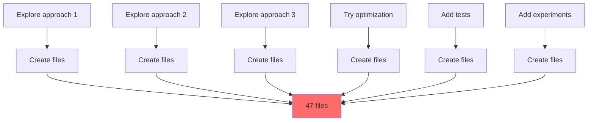
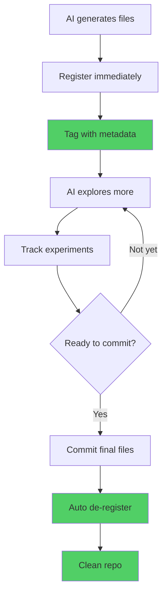

# Your AI Made 47 Files: Now What?

## The AI File Explosion

```bash
You: "Claude, implement user authentication"

Claude: "I'll explore a few approaches..."

# 10 minutes later

$ git status

Untracked files:
  auth_v1_jwt.ts
  auth_v2_session.ts
  auth_v3_oauth.ts
  auth_v4_hybrid.ts
  auth_final.ts
  auth_actually_final.ts
  auth_no_really_final.ts
  test_auth_v1.spec.ts
  test_auth_v2.spec.ts
  experiment_passwordless.ts
  experiment_magic_link.ts
  backup_original_auth.ts
  temp_debug_auth.ts
  notes_auth_approaches.md
  ...and 33 more files
```

**You**: "Which one did we decide on?"  
**Claude**: "The final one!"  
**You**: "Which final?"  
**Claude**: "..."

Welcome to AI coding in 2025.

<!--truncate-->

## The Problem: AI Thinks Out Loud (In Files)

### Human Developers Think, Then Code


**Output**: 1 file per feature

### AI Assistants Think While Coding



**Output**: 47 files per feature

**The difference**: AI exploration is **visible** in your filesystem.

## The Three AI File Chaos Problems

### Problem 1: The Exploration Graveyard

AI assistants explore solutions:

```bash
# You: "Implement authentication"

# AI creates while thinking:
auth_approach_1_simple.ts        # First idea
auth_approach_2_secure.ts        # More secure
auth_approach_3_performant.ts    # Optimized
auth_approach_4_scalable.ts      # Enterprise-ready
auth_final_v1.ts                 # Thinks it's done
auth_final_v2_fixed.ts           # Actually done
auth_final_v3_really.ts          # No really, done now
```

**Question**: Which file is "the one"?

**Without tracking**: ¯\\_(ツ)_/¯  
**With WIP registry**: Tagged with notes, obvious which is final

### Problem 2: The Experiment Dump

```bash
# AI explores possibilities you didn't ask for

experiment_passwordless.ts       # What if...
experiment_biometric.ts          # Could we...
experiment_blockchain_auth.ts    # Why not try...
experiment_quantum_crypto.ts     # Just checking...
temp_test_performance.ts         # Testing idea
temp_compare_approaches.ts       # Comparing
draft_alternative_flow.ts        # Sketching
```

**Question**: Which are experiments vs production code?

**Without tracking**: Can't tell  
**With WIP registry**: Clearly categorized

### Problem 3: The Feature Ambiguity

```bash
# AI generates files for multiple features

user_auth.ts          # Authentication? Or user management?
api_client.ts         # Auth API? Or general API?
middleware.ts         # For auth? Or for something else?
utils.ts              # Auth utils? Generic utils?
types.ts              # Auth types? Shared types?
```

**Question**: Which feature does each belong to?

**Without tracking**: Guess and hope  
**With WIP registry**: Explicitly linked to features

## Real Horror Story: The 100 File Commit

```bash
# Day 1
You: "Build a dashboard"
AI: *generates 100 files exploring 5 different approaches*

# Day 2
You: (impressed by AI speed)
git add .
git commit -m "AI: Dashboard implementation"
git push

# Day 3
Teammate: "Why are there 5 different dashboard implementations?"
You: "Uh... AI was exploring options?"
Teammate: "Which one works?"
You: "Let me check..."
# Spends 4 hours reading all 100 files

# Day 4
You: "I think it's dashboard_v5.ts"
Teammate: "That one has bugs"
You: "Maybe dashboard_v3.ts?"
Teammate: "That's incomplete"

# Result: Wasted week, messy repo, confused team
```

**The problem**: You let AI explore without tracking what's what.

## Enter: WIP Registry for AI

WIP registry is your **AI lab notebook**. It tracks every file the AI generates with:

- Which feature it belongs to
- Why the AI created it
- Whether it's experimental or final
- What problem it solves
- When it was generated



## The AI-Optimized Workflow

### Session 1: AI Exploration

```bash
You: "Cursor, implement authentication with multiple approaches"

# Cursor generates
auth_jwt.ts
auth_session.ts
auth_oauth.ts

# You register them immediately
sc wip register auth_jwt.ts \
  --feature=user-auth \
  --requirement=REQ-042 \
  --notes="JWT approach - AI's first attempt"

sc wip register auth_session.ts \
  --feature=user-auth \
  --requirement=REQ-042 \
  --notes="Session-based - simpler but less scalable"

sc wip register auth_oauth.ts \
  --feature=user-auth \
  --requirement=REQ-042 \
  --notes="OAuth - most flexible, chosen approach ✓"
```

### Session 2: AI Refinement

```bash
You: "Cursor, add tests for the OAuth approach"

# Cursor generates
test_auth_oauth.spec.ts
test_auth_oauth_integration.spec.ts

# You register
sc wip register test_*.spec.ts \
  --feature=user-auth \
  --requirement=REQ-042 \
  --notes="Test suite for OAuth implementation"
```

### Session 3: AI Experiments

```bash
You: "Cursor, explore passwordless options"

# Cursor generates experimental files
experiment_passwordless.ts
experiment_magic_link.ts
temp_test_passwordless.ts

# You register as experiments
sc wip register experiment_*.ts \
  --feature=user-auth \
  --category=experiments \
  --notes="Exploring passwordless - not for prod yet"
```

### Decision Time

```bash
# Check what you have
sc wip list

# Output:
# user-auth (REQ-042):
#   Production:
#     ✓ auth_oauth.ts (chosen approach)
#     ✓ test_auth_oauth.spec.ts
#     ✓ test_auth_oauth_integration.spec.ts
#
#   Experiments:
#     • auth_jwt.ts (first attempt)
#     • auth_session.ts (simpler but limited)
#     • experiment_passwordless.ts
#     • experiment_magic_link.ts
#
#   Age warnings:
#     ⚠️  temp_test_passwordless.ts (3 days old)

# Decision is obvious
git add auth_oauth.ts test_auth_oauth*.spec.ts
git commit -m "[FEATURE:user-auth] REQ-042: Implement OAuth authentication"

# Pre-staging auto-cleans
sc wip status
# Clean! Experiments still tracked, committed files removed
```

## The WIP Registry for AI

```yaml
# .supernal/wip-registry.yaml
files:
  # Final implementation
  - path: auth_oauth.ts
    feature: user-auth
    requirement: REQ-042
    notes: 'OAuth implementation - FINAL after AI explored 3 approaches'
    ai_generated: true
    ai_session: '2025-11-29-morning'
    registered: 2025-11-29T10:00:00Z

  # Experiments (not for commit)
  - path: experiment_passwordless.ts
    feature: user-auth
    requirement: REQ-042
    category: experiments
    notes: 'AI explored passwordless - interesting but not for MVP'
    ai_generated: true
    keep_until: 'REQ-042 complete, then decide'
    registered: 2025-11-29T14:00:00Z

  # Old files (needs cleanup)
  - path: temp_test_performance.ts
    feature: user-auth
    requirement: REQ-042
    category: temp
    notes: 'AI performance test - probably not needed'
    ai_generated: true
    registered: 2025-11-26T10:00:00Z
    age_warning: true
```

## AI-Specific WIP Registry Commands

### Batch Register AI Output

```bash
# AI generated 20 files
sc wip register *.ts \
  --feature=dashboard \
  --requirement=REQ-050 \
  --notes="AI initial implementation" \
  --ai-session="$(date +%Y-%m-%d-%H%M)"
```

### Categorize AI Experiments

```bash
# Mark experimental files
sc wip register experiment_*.ts \
  --category=experiments \
  --notes="AI exploring alternatives"

# Mark temp files
sc wip register temp_*.ts \
  --category=temporary \
  --notes="AI debugging/testing"
```

### Track AI Sessions

```bash
# Start new AI session
export AI_SESSION=$(date +%Y-%m-%d-%H%M)

# Register all AI output with session tag
sc wip register <files> --ai-session="$AI_SESSION"

# Later: Review session
sc wip list --ai-session="2025-11-29-1400"
```

### Compare AI Approaches

```bash
# AI generated 3 approaches
sc wip register approach_*.ts \
  --feature=auth \
  --category=comparison

# Add notes to each
sc wip update approach_1.ts \
  --notes="Simple but limited - NOT CHOSEN"

sc wip update approach_2.ts \
  --notes="Complex but powerful - NOT CHOSEN"

sc wip update approach_3.ts \
  --notes="Balanced and scalable - CHOSEN ✓"
```

## The AI Collaboration Pattern

### Pattern 1: Iterative Refinement

```bash
# Round 1: AI first attempt
You: "Build feature X"
AI: *generates 10 files*
You: sc wip register * --notes="AI first pass"

# Round 2: Your feedback
You: "Fix issues A, B, C"
AI: *modifies 5 files, adds 3 new*
You: sc wip register new-files --notes="AI fixes round 2"

# Round 3: Final polish
You: "Optimize and add tests"
AI: *refines code, adds tests*
You: sc wip list  # Review what's final
You: git commit <final files>
```

### Pattern 2: Multi-Feature AI Session

```bash
# AI works on 3 features simultaneously
AI: *generates 50 files*

# You organize them
sc wip register auth_*.ts \
  --feature=user-auth

sc wip register dashboard_*.ts \
  --feature=dashboard

sc wip register api_*.ts \
  --feature=api-integration

# Clear separation maintained
sc wip list --by-feature
# Shows: 15 auth, 20 dashboard, 15 api
```

### Pattern 3: Experiment Management

```bash
# AI explores 5 solutions
AI: *generates solution1.ts through solution5.ts*

# You test each
npm test solution1.spec.ts  # ❌ fails
npm test solution2.spec.ts  # ❌ fails
npm test solution3.spec.ts  # ✅ passes
npm test solution4.spec.ts  # ❌ fails
npm test solution5.spec.ts  # ✅ passes

# Track results
sc wip update solution3.ts --notes="WORKS ✓ - tests pass"
sc wip update solution5.ts --notes="WORKS ✓ - tests pass, faster"

# Commit winner
git add solution5.ts
git commit -m "Implement optimized solution (AI approach #5)"
```

## Real Benefits for AI Coding

### Before WIP Registry

```bash
# After 5 AI sessions
$ git status

Untracked files: 127

# You have no idea:
# - Which files are final
# - Which are experiments
# - Which feature each belongs to
# - Which AI session created them
# - Which ones to commit

# Result: Analysis paralysis
```

### After WIP Registry

```bash
# After 5 AI sessions
$ sc wip status

WIP Registry Status:
  Total: 127 files
  By feature:
    user-auth: 23 files (18 prod, 5 experiments)
    dashboard: 45 files (30 prod, 10 experiments, 5 temp)
    api-integration: 34 files (25 prod, 9 experiments)
    performance: 25 files (0 prod, 25 experiments)

  Ready to commit: 73 files
  Experiments: 29 files
  Old files (>7d): 5 files

# You know exactly what to do
$ sc wip list --category=production | xargs git add
$ git commit -m "Implement features from AI sessions"
```

## The Economic Argument (AI Edition)

### Cost Without WIP Registry

**AI Session Cost**:

- AI generates: 50 files in 10 minutes (Free)
- You analyze: 30 minutes to understand (Your time)
- Wrong files committed: 1 hour to fix (Your time + CI)
- Forgotten files: 2 hours debugging later (Your time + frustration)

**Per session cost**: 3.5 hours of your time

### Cost With WIP Registry

**AI Session Cost**:

- AI generates: 50 files in 10 minutes (Free)
- You register: 5 minutes adding metadata (Your time)
- Clear organization: 2 minutes to commit (Your time)
- Zero mistakes: 0 hours fixing (Saved)

**Per session cost**: 7 minutes of your time

**Savings**: 3 hours 23 minutes per AI session

### Weekly Impact

5 AI coding sessions per week:

**Without WIP registry**: 17.5 hours managing AI output  
**With WIP registry**: 35 minutes managing AI output  
**Savings**: 17 hours/week = 884 hours/year

At $100/hour: **$88,400 saved per year**

## Setup for AI Coding

```bash
# Install
npm install -g supernal-code

# Initialize with AI mode
sc init --ai-mode

# Configure AI-optimized WIP registry
sc wip config --ai-optimized
```

### AI-Optimized Configuration

```yaml
# .supernal/wip-registry.yaml
ai_mode: true
settings:
  auto_detect_experiments: true # Files named experiment_*, temp_*
  auto_detect_versions: true # Files with v1, v2, v3 patterns
  track_ai_sessions: true # Group by timestamp
  warn_duplicate_approaches: true # Alert if AI created multiple solutions
  auto_categorize: true # Smart categorization
```

## Best Practices for AI + WIP Registry

### 1. Register Immediately

```bash
# ✅ Good: Register as AI generates
You: "AI, build feature"
AI: *creates file1.ts*
You: sc wip register file1.ts --feature=X
AI: *creates file2.ts*
You: sc wip register file2.ts --feature=X

# ❌ Bad: Wait until session ends
AI: *creates 50 files*
You: (tries to remember what each is for)
```

### 2. Use Rich Metadata

```bash
# ✅ Good: Descriptive notes
sc wip register auth.ts \
  --notes="OAuth implementation - AI's 3rd approach, uses PKCE flow, production-ready"

# ❌ Bad: Minimal info
sc wip register auth.ts
```

### 3. Track AI Decision Points

```bash
# When AI presents options
You: "Should we use approach A or B?"
AI: "B is more scalable"
You: sc wip update approach_b.ts \
      --notes="CHOSEN: More scalable per AI recommendation"
You: sc wip update approach_a.ts \
      --notes="NOT CHOSEN: Less scalable, keeping for reference"
```

## Common Questions

### "Can't I just trust AI to make good files?"

**No**. AI explores. That's its strength. But exploration creates artifacts.

You need to track which artifacts matter.

### "Isn't this just for experiments?"

**No**. It's for _everything_ AI generates, because with AI:

- Production code looks like experiments
- Experiments look like production code
- You can't tell without tracking

### "Won't this slow down AI?"

**No**. AI generates at the same speed. You just organize the output better.

**Without WIP registry**: Fast generation, slow decision-making  
**With WIP registry**: Fast generation, fast decision-making

## The Bottom Line

AI assistants are **file generation machines**. WIP registry is your **organization system**.

**5 minutes of setup** = **Never wonder "what's this AI file?" again**

```bash
# Start tracking AI output
sc init --ai-mode

# Register AI files
sc wip register <files> --feature=X --ai-generated

# Always know what's what
sc wip status

# Commit with confidence
git commit
```

Your AI stays productive. Your repo stays clean. Your sanity stays intact.

---

**Using AI assistants? How do you manage the file chaos?** Drop a comment!

_Published: November 30, 2025_
