# Compliant Vibes: Why AI-Generated Code Needs Structure to Meet Regulatory Requirements

Andrej Karpathy coined the term "vibe coding" in early 2024: the practice of describing what you want in natural language and letting AI generate the code. It's fast. It's accessible. It's transforming how software gets built.

And it's a compliance nightmare.

Your vibes might be immaculate... _until an auditor shows up asking for your change control documentation_.

<!--truncate-->

## What Is Vibe Coding?

Vibe coding is AI-assisted development where you communicate intent rather than write syntax:

```
You: "Build a user authentication system with email verification and password reset"

AI: *generates 30 files with models, controllers, services, tests, and documentation*

You: "Make the password requirements stricter and add rate limiting"

AI: *modifies 8 files, adds new middleware, updates tests*
```

**Speed**: What took days now takes several minutes.

**Accessibility**: Non-programmers can build functional software.

**Iteration**: Ideas become code almost as fast as you can think them.

Linus Torvalds himself recently commented that he's "fine with vibe coding"—just don't use it on anything important. Andrew Ng from Google Brain advocates for everyone learning programming through vibe coding tools.

The appeal is undeniable. The risks? Also undeniable.

## The Vibe Coding Problem

### Problem 1: Security Vulnerabilities

AI-generated code optimizes for "works" not "secure."

```typescript
// AI-generated authentication - looks functional
export async function login(email: string, password: string) {
  const user = await db.users.findOne({ email });
  if (user && user.password === password) {
    // 🚨 Plaintext password comparison
    return generateToken(user);
  }
  throw new Error('Invalid credentials');
}
```

The AI gave you working code. It didn't give you secure code. Input validation? Missing. Password hashing? Absent. Rate limiting? What rate limiting?

### Problem 2: Inconsistent Quality

Vibe coding produces code that reflects the conversation, not your codebase standards.

Monday's AI session uses one naming convention:
```typescript
const getUserById = (id) => { ... }
const fetchUserProfile = (userId) => { ... }
```

Wednesday's session uses another:
```typescript
const get_user_by_id = (id) => { ... }
const GetUserProfile = (user_id) => { ... }
```

No one reviewed the patterns. No one enforced standards. The codebase becomes can an archaeological dig with amazing code buried with with its nemesis - bad code. 

### Problem 3: Missing Documentation

AI generates code fast. It doesn't generate context.

```bash
# What you get:
src/
  auth/
    service.ts      # 400 lines, no comments
    controller.ts   # 200 lines, JSDoc says "Authentication controller"
    middleware.ts   # 150 lines, TODO comments everywhere

# What auditors need:
- Why was this design chosen?
- What alternatives were considered?
- Who approved this architecture?
- When was the last security review?
```

The code exists. The story behind it doesn't.

### Problem 4: The Compliance Gap

This is the gap that matters for regulated industries.

**Compliance requires evidence**. Not that code works—that you can *prove* it works the way you claim, was built following approved processes, and can be traced from requirement to implementation to test.


Vibe coding gives you F→G. Compliance needs A→B→C→D→E.

## Why Compliance Doesn't Vibe

### The Auditor Conversation

**HIPAA Auditor**: "Show me your access control implementation."

**Vibe Coder**: "Here's the code."

**Auditor**: "Great. Show me the requirement this implements."

**Vibe Coder**: "I asked Claude to build it."

**Auditor**: "That's a prompt, not a requirement. Where's the acceptance criteria? The risk assessment? The approval record?"

**Vibe Coder**: "..."

**Auditor**: *writes finding*

### What Auditors Actually Need

| Compliance Element | What It Means | Vibe Coding Gap |
|-------------------|---------------|-----------------|
| **Traceability** | Link requirements → code → tests | AI prompts aren't traceable |
| **Change Control** | Document why changes were made | "Claude did it" isn't documentation |
| **Audit Trail** | Who changed what, when | Chat logs aren't audit evidence |
| **Evidence Collection** | Prove controls work | Screenshots of AI output don't count |
| **Reproducibility** | Same inputs → same outputs | AI is non-deterministic |

### The HIPAA Example

HIPAA §164.312(a)(1) requires access controls. Here's what compliance looks like:

**Requirement** (documented, approved):
```gherkin
Feature: User Access Control
  As a security officer
  I want user access to be controlled
  So that PHI is protected per HIPAA requirements

  Scenario: Failed login lockout
    Given a user has failed to login 3 times
    When they attempt a 4th login
    Then the account should be locked
    And an audit event should be recorded
```

**Implementation** (traceable to requirement):
```typescript
// REQ-HIPAA-312a1: Access Control Implementation
// Implements: comp-hipaa-043-access-control
export class AccessControlService {
  async handleLogin(attempt: LoginAttempt): Promise<LoginResult> {
    const failedAttempts = await this.getFailedAttempts(attempt.userId);

    if (failedAttempts >= 3) {
      await this.lockAccount(attempt.userId);
      await this.audit.log('ACCOUNT_LOCKED', {
        userId: attempt.userId,
        reason: 'excessive_failed_attempts',
        timestamp: new Date().toISOString(),
      });
      throw new AccountLockedException();
    }
    // ... implementation
  }
}
```

**Test Evidence** (automated, reproducible):
```typescript
describe('HIPAA §164.312(a)(1) - Access Control', () => {
  it('locks account after 3 failed attempts', async () => {
    // Given
    await simulateFailedLogins(userId, 3);

    // When
    const result = await accessControl.handleLogin({ userId, password: 'wrong' });

    // Then
    expect(result.accountLocked).toBe(true);
    expect(await auditLog.hasEntry('ACCOUNT_LOCKED', userId)).toBe(true);
  });
});
```

**Audit Evidence** (collected automatically):
```json
{
  "requirement": "comp-hipaa-043-access-control",
  "implementation": "src/services/AccessControlService.ts",
  "tests": ["tests/hipaa/access-control.test.ts"],
  "lastTestRun": "2025-12-05T14:30:00Z",
  "testResult": "PASSED",
  "approvedBy": ["@security-lead", "@compliance-officer"],
  "approvalDate": "2025-11-15"
}
```

**None of this comes from vibes**.

## The Supernal Solution: Structured Vibes

What if you could have the speed of vibe coding AND the evidence compliance demands?

That's what Supernal Coding provides: **guardrails that let AI generate code while automatically creating the compliance trail**.

### Structure 1: Requirements That AI Can Implement

Instead of vague prompts, start with structured requirements:

```bash
# Create a requirement with compliance context
sc requirement new "Access Control" \
  --epic=hipaa-compliance \
  --priority=high \
  --compliance-card=comp-hipaa-043
```

This generates a template that AI can fill out with Gherkin specification:

```gherkin
# REQ-042: Access Control
Feature: Access Control Implementation
  As a system administrator
  I want to control user access
  So that HIPAA §164.312(a)(1) is satisfied

  @compliance @hipaa @comp-hipaa-043
  Scenario: Account lockout after failed attempts
    Given a user "test@example.com" exists
    And the user has failed to login 3 times
    When they attempt a 4th login with wrong password
    Then the account should be locked for 30 minutes
    And an audit entry should be created with type "ACCOUNT_LOCKED"
```

Now when you tell AI "implement REQ-042," there's traceability. The requirement is documented. The acceptance criteria are testable. The compliance mapping exists.

### Structure 2: Git Hooks That Enforce Standards

AI generates code fast. Hooks catch problems before commit:

```mermaid
sequenceDiagram
    participant AI as AI Assistant
    participant Dev as Developer
    participant Hook as Git Hooks
    participant Audit as Audit Trail
    participant Repo as Repository

    AI->>Dev: Generates 30 files
    Dev->>Hook: git commit
    Hook->>Hook: Run compliance checks
    Hook->>Hook: Verify traceability
    Hook->>Hook: Check for secrets
    Hook->>Hook: Validate test coverage
    Hook-->>Dev: ❌ Missing REQ reference
    AI->>Dev: Fix: Add REQ-042 reference
    Dev->>Hook: git commit (again)
    Hook->>Hook: ✅ All checks pass
    Hook->>Audit: Log commit with traceability
    Hook->>Repo: Commit approved
```



```bash
# Install compliance-aware hooks
sc git-hooks install

# What runs on every commit:
# ✅ Requirement traceability (commit linked to REQ)
# ✅ Compliance validation (no secrets, audit logging)
# ✅ Test coverage (relevant tests pass)
# ✅ Documentation check (changes documented)
```

AI can generate at full speed. The hooks ensure only compliant code ships.

### Structure 3: Compliance Cards as Implementation Guides

Compliance Cards break regulatory requirements into implementable units:

```bash
# See what HIPAA requires for access control
sc compliance card comp-hipaa-043
```

Output:
```markdown
# COMP-HIPAA-043: Access Control

## Requirement
HIPAA §164.312(a)(1) - Implement technical policies and procedures
for electronic information systems that maintain ePHI to allow access
only to those persons or software programs granted access rights.

## Acceptance Criteria
Given an access control system is implemented
When a user attempts to access ePHI
Then access should be granted only if user has appropriate permissions
And all access attempts should be logged
And failed attempts should trigger lockout after threshold

## Evidence Required
- [ ] Access control policy document
- [ ] Implementation code with audit logging
- [ ] Test results showing lockout behavior
- [ ] Audit log samples showing access tracking

## Cross-Framework Mapping
- ISO 27001 A.9.1.1: Access control policy
- SOC 2 CC6.1: Logical access security
```

When AI implements this, it has context. When auditors review, they have mapping. When you track progress, you have checklists.

### Structure 4: Automated Evidence Collection

The compliance trail builds itself:

```yaml
# .supernal/compliance-evidence/comp-hipaa-043.yaml
card: comp-hipaa-043
framework: hipaa
control: §164.312(a)(1)
status: implemented

evidence:
  policy:
    file: docs/policies/access-control-policy.md
    approved: 2025-11-15
    approvedBy: ["@security-lead"]

  implementation:
    files:
      - src/services/AccessControlService.ts
      - src/middleware/authMiddleware.ts
    commits:
      - hash: "abc123"
        message: "REQ-042: Implement access control with audit logging"
        date: "2025-11-20"

  tests:
    file: tests/hipaa/access-control.test.ts
    lastRun: 2025-12-05T14:30:00Z
    result: PASSED
    coverage: 94%

  audit_logs:
    sample: .supernal/audit-samples/access-control-2025-12.json
    format: JSON
    retention: 6_years
```

When the auditor asks for evidence, you generate it:

```bash
sc compliance evidence --card=comp-hipaa-043 --output=audit-package/
```

### Structure 5: Audit Trail by Design

Every significant action is logged:

```json
{
  "event": "REQUIREMENT_IMPLEMENTED",
  "timestamp": "2025-12-05T14:32:15.123Z",
  "requirement": "REQ-042",
  "compliance_card": "comp-hipaa-043",
  "actor": {
    "human": "developer@company.com",
    "ai_assistant": "claude-3.5-sonnet"
  },
  "changes": {
    "files_created": ["src/services/AccessControlService.ts"],
    "files_modified": ["src/app.ts"],
    "tests_added": 4,
    "tests_passed": 4
  },
  "traceability": {
    "requirement": "REQ-042",
    "epic": "EPIC-HIPAA",
    "commit": "abc123def"
  }
}
```

The AI can vibe. The audit trail captures reality.

## The Compliant Vibes Workflow

Here's how it works in practice:

### Step 1: Start with Structure

```bash
# Create feature with compliance context
sc feature create access-control --domain=compliance --epic=hipaa
sc requirement new "User Access Lockout" --compliance-card=comp-hipaa-043
```

### Step 2: Let AI Vibe (With Context)

```
You: "Implement REQ-042 (access control with lockout) following the
acceptance criteria in the requirement. Use the compliance card
comp-hipaa-043 as guidance. Include audit logging."

AI: *generates implementation with proper context*
```

The AI now has:
- Structured requirement with acceptance criteria
- Compliance card with specific evidence needs
- Context about audit logging requirements

### Step 3: Validate Before Commit

```bash
git add .
git commit -m "REQ-042: Implement access control lockout"

# Hooks run automatically:
# ✅ REQ-042 exists and is in-progress
# ✅ Tests for access control pass
# ✅ Audit logging implemented
# ✅ No secrets in code
# ✅ Traceability verified
# Commit approved
```

### Step 4: Evidence Accumulates Automatically

```bash
# Check compliance status
sc compliance status --card=comp-hipaa-043

# Output:
# comp-hipaa-043: Access Control
# Status: IMPLEMENTED ✅
# Evidence:
#   - Policy: ✅ Approved 2025-11-15
#   - Implementation: ✅ REQ-042 complete
#   - Tests: ✅ 4/4 passing
#   - Audit Logs: ✅ Sample collected
# Ready for audit: YES
```

## The Numbers

### Without Supernal (Pure Vibe Coding)

| Metric | Value |
|--------|-------|
| Time to generate code | 10 minutes |
| Time to make it compliant | 4-8 hours |
| Audit preparation time | 2-3 days |
| Evidence collection | Manual |
| Traceability | None |
| Auditor findings | Many |

### With Supernal (Compliant Vibes)

| Metric | Value |
|--------|-------|
| Time to generate code | 15 minutes (includes structure) |
| Time to make it compliant | Already compliant |
| Audit preparation time | 30 minutes |
| Evidence collection | Automated |
| Traceability | Complete |
| Auditor findings | Minimal |

The 5 extra minutes of structure upfront saves days of compliance work later.

## Real Talk: What This Isn't

### This isn't "AI-proof" compliance

AI makes mistakes. Structure catches them faster, but human review still matters for critical controls.

### This isn't one-click compliance

You still need to understand the regulations. You still need security expertise. The tools help—they don't replace knowledge.

### This isn't bureaucracy for bureaucracy's sake

The structure serves a purpose: auditable, traceable, defensible software development. If your industry doesn't require it, you probably don't need it.

## Who Needs Compliant Vibes?

**Healthcare (HIPAA)**:
- Protected health information
- Audit trail requirements
- Access control documentation

**Finance (SOC 2, PCI-DSS)**:
- Security controls
- Change management
- Incident response

**Medical Devices (FDA 21 CFR Part 11, ISO 13485)**:
- Electronic signatures
- Design history files
- Validation protocols

**AI Systems (EU AI Act, EN 18031)**:
- Model governance
- Risk assessments
- Transparency requirements

**Anyone with auditors**:
- If someone's going to ask "prove it," you need structure.

## Getting Started

```bash
# Install Supernal Coding
npm install -g supernal-code

# Initialize with compliance frameworks
sc init --compliance-frameworks=hipaa,soc2

# Install compliance-aware hooks
sc git-hooks install

# Create your first compliant requirement
sc requirement new "Feature Name" \
  --epic=your-epic \
  --compliance-card=relevant-card

# Let AI vibe (with structure)
# ...generate code...

# Commit with automatic compliance validation
git add .
git commit -m "REQ-XXX: Description"

# Check compliance status anytime
sc compliance status
```

## The Bottom Line

Vibe coding is here to stay. It's too productive to ignore.

But vibes alone don't pass audits. They don't create traceability. They don't collect evidence.

**Compliant vibes = vibe coding + structure**.

The structure isn't overhead—it's the evidence that lets you use AI at full speed in regulated environments.

Vibe responsibly.

---

_Building software in a regulated industry? Check out [Compliance Cards](/docs/compliance/) for 300+ pre-structured regulatory requirements, or see the [Getting Started Guide](/docs/guides/getting-started) to set up compliant AI-assisted development._

