# Parallel Development with Continuous Reconnection: Coordinating Multiple AI Agents

You know that feeling when you have 2+ AI agents working on the same codebase and everything becomes chaos?

Agent 1 creates 10 files for authentication. Agent 2 creates 10 files for the dashboard. You try to commit Agent 1's work and git says: "Wait, you have 20 untracked files. Which ones are yours?"

Now you're staring at a mixed pile of files, trying to figure out which belong to which feature, which agent created what, and whether you're about to commit someone else's work-in-progress.

**There's a better way.**

<!--truncate-->

## The Traditional Nightmare

Here's what most of us do:


**Three features = three branches = three separate merge operations = merge conflict hell**

The overhead kills you:

- Git checkout dance (stash, switch, reload)
- Mental context switching
- "Wait, which branch has that change?"
- Merge conflict resolution
- Can't see the integrated picture until everything merges

And then there's the untracked files problem:

```bash
git status
# Untracked files:
#   docs/new-design.md        # Which feature?
#   lib/helper.js             # WIP or forgotten?
#   test-script.sh            # Keep or delete?
```

Every untracked file is a question mark. Which feature does it belong to? Is it work-in-progress or did I forget about it? Should I commit it now or later?

## Enter: Multi-Feature Branch Development

What if instead of one feature per branch, you worked on **multiple related features on the same branch**? Tag each commit with its feature to track progress:


**Multiple features on one branch. Work on related features simultaneously. Create PR when sprint/domain work complete.**

This enables "parallel domain development" - work on multiple features within the same domain (payment, auth, dashboard) on one branch, avoiding integration issues by building them together.

## The Two Systems That Make It Work

### 1. WIP Registry: Know What Every File Is For

**The Problem**: You have files that aren't ready to commit yet. Where do they live? What feature are they for?

**The Solution**: A registry (not a directory!) that tracks work-in-progress files.


**Real workflow**:

```bash
# Create a file
vim docs/auth-design.md

# Register it (required before you can commit)
sc wip register docs/auth-design.md \
  --feature=user-auth \
  --requirement=REQ-042 \
  --reason="Drafting authentication design"

# Work on it as long as you need...

# When ready, just commit
git add docs/auth-design.md
git commit -m "[FEATURE:user-auth] REQ-042: Add auth design"

# Automatically de-registers from WIP registry!
```

**What this solves**:

- ✅ No more "which feature is this?" questions
- ✅ No forgotten files
- ✅ Clear ownership of every file
- ✅ Automatic cleanup when committed

The registry (`.supernal/wip-registry.yaml`) looks like this:

```yaml
files:
  - path: docs/auth-design.md
    feature: user-auth
    requirement: REQ-042
    reason: 'Drafting authentication design'
    registered: 2025-11-29T10:00:00Z
    last_modified: 2025-11-29T14:30:00Z
```

Files live in their normal locations—the registry just tracks them until they're committed.

### 2. Feature-Based Commits: Work on Multiple Features Without Switching

**The Problem**: Every time you switch features, you switch branches. That means:

- `git checkout` overhead
- Mental context reload
- Stashing uncommitted work
- Merge conflicts when you're done

**The Solution**: Tag commits with features instead of creating branches.

```mermaid
sequenceDiagram
    participant Dev as Developer
    participant Main as main branch
    participant Tests as CI/CD

    Dev->>Main: [FEATURE:auth] REQ-042: Add login
    Main->>Tests: Run tests
    Tests-->>Main: ✅ Pass

    Dev->>Main: [FEATURE:dashboard] REQ-050: Add widget
    Main->>Tests: Run tests
    Tests-->>Main: ✅ Pass

    Dev->>Main: [FEATURE:auth] REQ-042: Add validation
    Main->>Tests: Run tests
    Tests-->>Main: ✅ Pass

    Note over Dev,Tests: All work integrated continuously!
```



**Real workflow**:

```bash
# Morning: Register a feature
sc fbc add user-auth \
  --description="User authentication system" \
  --requirements=REQ-042,REQ-043

# Work on auth (on main!)
git commit -m "[FEATURE:user-auth] REQ-042: Implement login endpoint"

# Afternoon: Switch to dashboard (no git checkout!)
git commit -m "[FEATURE:dashboard] REQ-050: Add widget framework"

# Back to auth (instant!)
git commit -m "[FEATURE:user-auth] REQ-043: Add JWT validation"

# View all auth commits
git log --grep="[FEATURE:user-auth]"

# Or use the command
sc fbc commits user-auth
```

**What this solves**:

- ✅ Zero branch switching overhead
- ✅ Instant context switching
- ✅ All work visible immediately
- ✅ Easy to see what belongs to which feature
- ✅ No merge conflicts

## The Secret Sauce: Micro-Merges

Here's why this works so well.

**Traditional branching** = big-bang integration:


**Feature-based commits** = continuous micro-merges:


**Every commit**:

1. Tests run (pre-commit hook)
2. Merges to main (micro-merge)
3. Integrates with all other work
4. Issues caught immediately

**Small, safe, continuous.** No big-bang surprises.

## Safety Through Test Enforcement

"But wait," you're thinking, "isn't working directly on main dangerous?"

**Not if you enforce tests on every commit.**

```mermaid
flowchart TD
    A[Developer commits] --> B{Pre-commit hook}
    B -->|Check 1| C{All untracked files<br/>wip-tracked?}
    C -->|No| X[❌ Blocked]
    C -->|Yes| D{Feature tag valid?}
    D -->|No| X
    D -->|Yes| E{Tests pass?}
    E -->|No| X
    E -->|Yes| F{REQ-XXX present?}
    F -->|No| X
    F -->|Yes| G[✅ Commit succeeds]

    style G fill:#51cf66
    style X fill:#ff6b6b
```



**Four safety checks before every commit**:

1. **WIP registry check**: No untracked files (must be registered or ignored)
2. **Feature tag validation**: Feature must exist in registry (prevents typos)
3. **Test enforcement**: All tests must pass
4. **Requirement traceability**: Must have REQ-XXX for tracking

**The result**: Each micro-merge is validated before integration. Your main branch stays clean and working.

## A Complete Example

Let me show you what this looks like in practice.

### Step 1: Set up a feature

```bash
# Add feature to registry
sc fbc add user-auth \
  --description="User authentication system" \
  --requirements=REQ-042,REQ-043
```

### Step 2: Create a file

```bash
vim docs/auth-design.md
```

### Step 3: Register it in WIP registry

```bash
sc wip register docs/auth-design.md \
  --feature=user-auth \
  --requirement=REQ-042 \
  --reason="Drafting authentication design" \
  --add-comment
```

This adds a comment to your file:

```markdown
<!-- WIP: user-auth | REQ-042 | Drafting design -->
<!-- REGISTERED: 2025-11-29 | Remove when committing -->

# Authentication Design

## Overview

...
```

### Step 4: Check status anytime

```bash
sc wip status

# Output:
# WIP Registry Status:
#   Total: 1
#   Active: 1
#   Old (>3d): 0
```

### Step 5: Commit when ready

```bash
git add docs/auth-design.md
git commit -m "[FEATURE:user-auth] REQ-042: Add authentication design

Complete design for JWT-based authentication system."

# Pre-commit hook runs:
# ✅ Feature tag validated: user-auth
# ✅ All tests pass
# ✅ Auto de-registered: docs/auth-design.md
# ✅ Commit successful
```

### Step 6: Switch to another feature

```bash
# No git checkout needed!
vim src/dashboard/widgets.ts

sc wip register src/dashboard/widgets.ts \
  --feature=dashboard \
  --requirement=REQ-050

# Work on it...

git commit -m "[FEATURE:dashboard] REQ-050: Implement dashboard widgets"
```

## When This Works (And When It Doesn't)

### ✅ Perfect For

- **Solo developers**: Maximum velocity, zero coordination overhead
- **Small teams** (2-4 people): Fast-paced collaboration without branch overhead
- **Multiple features at once**: Context switching is instant
- **Strong test coverage**: Safety comes from test enforcement
- **Rapid iteration**: Ship fast, integrate continuously

This is ideal for:

- Startups building quickly
- Small product teams
- Internal tools
- Prototypes and experiments

### ❌ Not Ideal For

- **Large teams** (5+ developers): Too much coordination
- **Long-running features** (weeks/months): Better to isolate
- **Strict code review**: Pull requests provide formal review process
- **Regulatory compliance**: Audit trails may require PRs
- **External contributors**: Open source needs PR workflow

This won't work well for:

- Enterprise software with formal processes
- Open source projects
- Regulated industries (finance, healthcare)
- Mission-critical systems with strict change control

### 🔀 Use Both (Hybrid Approach)

You don't have to choose!

**Daily work**: Feature-based commits on main  
**Releases**: Cut a release branch  
**External PRs**: Use branches for contributors  
**Experiments**: Temporary branches, then delete

Best of both worlds.

## The Real Benefits

Let me give you some real numbers.

**Before** (branch-based):

- 30 seconds to switch branches × 6 switches/day = 3 minutes
- Mental context reload = 5-10 minutes of "where was I?"
- Merge conflicts = 15-60 minutes when you're done
- **Total overhead: 30-90 minutes per day**

**After** (feature-based):

- 0 seconds to switch features
- No mental reload (it's all right there)
- No merge conflicts (continuous integration)
- **Total overhead: ~30 seconds per day**

**Time saved: 30-90 minutes per day** for typical multi-feature development.

But the real benefit isn't just time—it's **flow state**. No more breaking concentration to switch branches. No more merge anxiety. Just continuous, focused work.

## Get Started

Want to try it? Here's how:

```bash
# Install Supernal Coding
npm install supernal-code

# Add a feature
sc fbc add my-feature \
  --description="My awesome feature" \
  --requirements=REQ-001

# Register a file
sc wip register my-file.md \
  --feature=my-feature \
  --requirement=REQ-001 \
  --reason="Initial draft"

# Commit with feature tag
git commit -m "[FEATURE:my-feature] REQ-001: Initial implementation"

# Check status
sc fbc stats
sc wip status
```

**All the commands**:

```bash
# WIP registry
sc wip register <file> --feature=<name> --requirement=REQ-XXX
sc wip list
sc wip status
sc wip check
sc wip cleanup --older-than=7d

# Features
sc fbc add <name> --description="..." --requirements=REQ-XXX
sc fbc list
sc fbc show <name>
sc fbc commits <name>
sc fbc complete <name>
sc fbc stats
```

## What We Built

To make this work, we built:

- **WipManager** (389 lines) - File registry management
- **FeatureManager** (240 lines) - Feature registry management
- **23 comprehensive tests** - All functionality covered
- **Complete documentation** - SOPs and guides
- **CLI integration** - Two new command groups

**Total**: 2,180 lines of code, tests, and documentation.

All tested. All documented. Ready to use.

## Wrapping Up

Parallel development with continuous reconnection isn't just a workflow change—it's a mindset shift.

Instead of isolating features in branches and merging them later (big-bang integration), you integrate continuously through micro-merges. Each commit is small, tested, and safe.

**Two systems make it work**:

1. **WIP registry**: Track WIP files by feature (no more "which feature?")
2. **Feature-based commits**: Tag commits, not branches (no switching overhead)

**The result**: Multiple features developing in parallel, safely, on a single branch.

It's not for everyone. Large teams and long features still need traditional branching. But for solo developers and small teams doing rapid parallel development? This is a game-changer.

---

**Want to learn more?** Check out the complete documentation (see SOP-0.1.12 in workspace) or get started with Supernal Coding at `/docs/guides/getting-started`.
