# Supernal Coding Comprehensive Workflow System

## Overview

The Supernal Coding Workflow System provides comprehensive development lifecycle management with intelligent state tracking, enhanced git hooks, and automated validation. It combines workflow state tracking with rigorous quality gates to ensure consistent development practices while maintaining developer productivity.

## 🎯 System Philosophy: "Easy Commits, Rigorous Push"

The system implements a dual-validation approach:

- **Pre-commit**: Lightweight, fast checks (1-3 seconds) for basic safety
- **Pre-push**: Comprehensive validation pipeline with full quality gates
- **Post-push**: Automated monitoring and CI/CD integration

## System Architecture

### Enhanced Git Workflow Integration


### State Flow Diagram


### Deviation Detection System

```mermaid
graph LR
    A["`📊 **Workflow Check**
    sc workflow check`"] --> B{"`🔍 **Git Branch Check**`"}
    A --> C{"`📋 **Requirements Check**`"}
    A --> D{"`💾 **Uncommitted Changes**`"}

    B -->|Wrong Branch| E["`⚠️ **WRONG_BRANCH**
    Suggest: git checkout main`"]
    B -->|Correct| F["`✅ **Branch OK**`"]

    C -->|Untracked Reqs| G["`ℹ️ **UNTRACKED_REQUIREMENTS**
    Suggest: sc req sync`"]
    C -->|All Tracked| H["`✅ **Requirements OK**`"]

    D -->|Has Changes| I["`⚠️ **UNCOMMITTED_CHANGES**
    Suggest: Commit or reset`"]
    D -->|Clean| J["`✅ **Working Dir Clean**`"]

    E --> K["`📊 **Deviation Report**`"]
    G --> K
    I --> K
    F --> K
    H --> K
    J --> K

    style E fill:#fff3e0
    style G fill:#e3f2fd
    style I fill:#fff3e0
    style F fill:#e8f5e8
    style H fill:#e8f5e8
    style J fill:#e8f5e8
```



## State Definitions

### Core States

| State                 | Description               | Next Actions                       | Auto-Transitions               |
| --------------------- | ------------------------- | ---------------------------------- | ------------------------------ |
| `INITIALIZED`         | Fresh after `sc init`     | Create requirement, setup workflow | None                           |
| `REQUIREMENT_CREATED` | Has REQ-001               | Create branch, validate            | None                           |
| `WORKFLOW_READY`      | Kanban system active      | Create requirement, begin work     | None                           |
| `DIRECT_DEV`          | Skipped formal process    | Start coding                       | None                           |
| `FEATURE_BRANCH`      | Working on feature branch | Code, validate, merge              | Auto when on feature branch    |
| `CHANGES_MADE`        | Files modified            | Validate, merge                    | Auto when files changed        |
| `COMPLETED`           | Requirement merged        | Next requirement                   | Auto when `sc git-smart merge` |
| `MERGE_CONFLICT`      | Conflicts need resolution | Resolve conflicts                  | Auto when merge fails          |

### Sub-States

- **Branch Tracking**: Monitors expected vs actual branch
- **Requirement Tracking**: Links active requirement to workflow state
- **Merge History**: Tracks successful/failed merges

## JSON State Structure

```json
{
  "version": "1.0.0",
  "created": "2025-01-15T10:30:00.000Z",
  "lastUpdated": "2025-01-15T14:45:00.000Z",

  "state": "FEATURE_BRANCH",
  "subState": null,

  "projectType": "Web Frontend",
  "gitInfo": {
    "isGitRepo": true,
    "root": "/path/to/project",
    "currentBranch": "feature/req-001",
    "hasRemote": true,
    "lastCommit": "abc123..."
  },

  "features": {
    "gitManagement": true,
    "kanbanSystem": true,
    "testingFramework": false
  },

  "completed": ["create_first_requirement", "start_feature_branch"],
  "pending": ["smart_merge_workflow", "validate_setup"],
  "warnings": [],

  "deviations": [
    {
      "type": "WRONG_BRANCH",
      "description": "Working on 'develop' but expected 'feature/req-001'",
      "detected": "2025-01-15T14:30:00.000Z",
      "severity": "warning",
      "resolved": false
    }
  ],

  "expectedBranch": "feature/req-001",
  "activeRequirement": "001",
  "requirements": ["001"],

  "smartMergeEnabled": true,
  "mergeHistory": [
    {
      "reqId": "001",
      "timestamp": "2025-01-15T14:45:00.000Z",
      "success": true,
      "branch": "feature/req-001"
    }
  ],

  "recommendedActions": [
    {
      "command": "sc req validate 001",
      "description": "Validate your changes meet the requirement",
      "priority": "high"
    }
  ]
}
```

## Enhanced Git Hooks System

### Hook Configuration

All git hook behaviors are controlled through `supernal.yaml`:

```yaml
[git.hooks]
pre_commit_enabled = true
pre_push_enabled = true
lightweight_pre_commit = true        # Keep pre-commit fast and simple
comprehensive_pre_push = true        # Full validation on pre-push

[git.hooks.pre_commit]
branch_protection = true             # Block commits to main/master
file_size_limit_mb = 10             # Warn on large files
sensitive_file_check = true          # Block sensitive file patterns
syntax_validation = true             # Quick syntax checks (non-blocking)

[git.hooks.pre_push]
test_suite_required = true           # Run full test suite
security_audit_required = true       # npm audit validation
requirement_validation = true        # sc req validate --all
rule_compliance_check = true         # sc rules validate
build_validation = true              # npm run build (if available)
type_duplication_check = true        # Configurable blocking behavior
```

### Hook Installation and Management

```bash
# Install all hooks
sc git-hooks install

# Check hook status
sc git-hooks status

# Test hooks
sc git-hooks test

# Install specific hooks
sc git-hooks install pre-commit
sc git-hooks install pre-push
```

### Pre-Commit Hook (Lightweight)

**Purpose**: Fast basic validation to prevent obvious mistakes

- **Execution time**: 1-3 seconds
- **Branch protection**: Blocks direct commits to main/master
- **File validation**: Warns on large files (>10MB), blocks sensitive files
- **Syntax checking**: Quick JSON/JS/TS validation (non-blocking warnings)

### Pre-Push Hook (Comprehensive)

**Purpose**: Complete validation pipeline before code reaches remote

- **Test suite**: Full `npm test` execution (blocks on failure)
- **Security audit**: `npm audit --audit-level=moderate` (blocks on vulnerabilities)
- **Requirement validation**: `sc req validate --all` (blocks on invalid requirements)
- **Rule compliance**: `sc rules validate` (blocks on rule violations)
- **Type duplication**: Configurable blocking based on project settings
- **Build validation**: `npm run build` if available (blocks on build failure)

### Error Handling and Recovery

All validation failures generate detailed logs in `.git/logs/`:

- `pre-push-tests-YYYYMMDD-HHMMSS.log` - Test results
- `pre-push-tests-*.log.audit` - Security audit results
- `pre-push-tests-*.log.req` - Requirement validation
- `pre-push-tests-*.log.rules` - Rule compliance results
- `pre-push-tests-*.log.types` - Type duplication analysis
- `pre-push-tests-*.log.build` - Build validation results

### Emergency Bypass Options

```bash
# Skip pre-commit validation
SC_SKIP_PRE_COMMIT=true git commit

# Skip pre-push validation
SC_SKIP_PRE_PUSH=true git push

# Skip all hooks (use with extreme caution)
git commit --no-verify
git push --no-verify
```

### Integration with sc git-smart

The enhanced hooks integrate seamlessly with `sc git-smart` workflows:

```bash
# Complete workflow with automatic monitoring
sc git-smart merge --push --delete-local

# The system automatically:
# 1. Runs pre-push validation
# 2. Pushes to remote on validation success
# 3. Starts GitHub Actions monitoring
# 4. Provides failure diagnosis if CI/CD fails
```

## Usage Guide

### Basic Commands

```bash
# Show current workflow status
sc workflow status

# Check for deviations
sc workflow check

# Show detailed workflow guide
sc workflow guide

# Mark action as completed
sc workflow complete create_first_requirement

# Start working on requirement (auto-updates state)
sc workflow start-req 001

# Complete requirement (auto-updates state)
sc workflow complete-req 001

# Reset workflow state (debugging)
sc workflow reset
```

### Integration with Existing Commands

The workflow tracker automatically integrates with existing supernal-coding commands:

#### After `sc init`

- ✅ Automatically initializes workflow state
- 🎯 Sets state to `INITIALIZED`
- 📋 Provides next step recommendations

#### After `sc git-smart branch` + `sc req update --status=in-progress`

- ✅ Updates state to `FEATURE_BRANCH`
- 🌿 Sets expected branch to `feature/req-001`
- 📋 Updates active requirement to `001`

#### After `sc git-smart merge`

- ✅ Updates state to `COMPLETED`
- 🎉 Resets expected branch to `main`
- 📋 Clears active requirement
- 🔄 Suggests next requirement

### Deviation Detection

The system automatically detects common workflow deviations:

#### Branch Deviations

```bash
# Working on wrong branch
Current: develop
Expected: feature/req-001 or main
Suggestion: git checkout feature/req-001
```

#### Requirement Tracking

```bash
# Untracked requirements found
Found: 5 requirement files
Tracking: 3 requirements
Suggestion: sc req sync
```

#### Working Directory Issues

```bash
# Uncommitted changes in completed state
State: COMPLETED
Issue: 15 uncommitted files
Suggestion: Commit changes or reset state
```

## Advanced Features

### Smart Merge Tracking

The system tracks merge success/failure patterns:

```mermaid
sequenceDiagram
    participant U as User
    participant W as Workflow Tracker
    participant G as Git Smart

    U->>W: sc workflow start-req 001
    W->>W: Set state: FEATURE_BRANCH
    W->>W: Set expectedBranch: feature/req-001

    U->>U: Make changes
    W->>W: Detect changes → CHANGES_MADE

    U->>G: sc git-smart merge
    G->>W: Merge successful
    W->>W: Set state: COMPLETED
    W->>W: Log merge history
    W->>U: Show next recommendations
```



### Project Type Adaptations

The workflow adapts recommendations based on detected project type:

- **Web Frontend**: Emphasizes component validation, accessibility
- **Node Backend**: Focuses on API testing, database validation
- **Mobile**: Highlights device testing, platform compliance
- **Python**: Emphasizes virtual environments, dependency management

### Configuration Management

Located in `.supernal-coding/workflow-state.json`:

- 📍 Tracks current position in workflow
- 🔄 Monitors state transitions
- ⚠️ Records deviations and resolutions
- 📊 Maintains completion history

## Troubleshooting

### Common Issues

#### Workflow State Not Found

```bash
⚠️ No workflow state found. Run `sc init` first.
```

**Solution**: Re-run `sc init` or manually initialize with `sc workflow init`

#### State Tracking Disabled

```bash
⚠️ Could not initialize workflow tracking: Permission denied
```

**Solutions**:

- Check `.supernal-coding` directory permissions
- Ensure write access to project root
- Run with appropriate permissions

#### Deviation Detection Fails

```bash
⚠️ Could not check git status: Not a git repository
```

**Solution**: Ensure you're in a git repository or initialize git tracking

### Reset and Recovery

```bash
# Complete reset
sc workflow reset

# Re-initialize after reset
sc workflow init

# Check status after recovery
sc workflow status
```

## Best Practices

### 1. Regular Status Checks

```bash
# Before starting work
sc workflow status

# After major changes
sc workflow check
```

### 2. Follow Recommended Actions

- Always review `recommendedActions` in workflow status
- Complete actions in priority order (high → medium → low)
- Use provided commands exactly as shown

### 3. Monitor Deviations

- Run `sc workflow check` when switching branches
- Address deviations promptly to maintain workflow integrity
- Use suggested solutions as starting points

### 4. Leverage Auto-Updates

- Use `sc git-smart branch` for creating feature branches
- Use `sc git-smart merge` for automatic state transitions
- Let the system track your progress automatically

## Development Integration

### VS Code Integration

Future: Workflow status in status bar, deviation notifications

### CI/CD Integration

Future: Workflow validation in automated pipelines

### Team Collaboration

Future: Shared workflow state for team coordination

## API Reference

### WorkflowStateTracker Class

```javascript
const tracker = new WorkflowStateTracker(projectRoot);

// Initialize workflow state
await tracker.initializeState(initOptions);

// Load current state
const state = await tracker.loadState();

// Update state with progress
await tracker.updateState(newState, completedAction, deviation);

// Check for deviations
const deviations = await tracker.checkDeviations();

// Show status summary
await tracker.showStatus();
```

### State Management Methods

```javascript
// Mark action completed
await tracker.updateState('FEATURE_BRANCH', 'start_feature_branch');

// Report deviation
await tracker.updateState(null, null, {
  type: 'WRONG_BRANCH',
  description: 'Working on develop instead of feature branch',
  severity: 'warning',
});

// Get recommended actions
const actions = tracker.getRecommendedActions(currentState, context);
```

## Future Enhancements

### Planned Features

- 🎯 **Smart Suggestions**: AI-powered next step recommendations
- 📊 **Analytics Dashboard**: Visual workflow progress tracking
- 🔄 **Team Synchronization**: Multi-developer workflow coordination
- 🎨 **Custom Workflows**: User-defined workflow patterns
- 📱 **Mobile Notifications**: Progress updates and deviation alerts

### Integration Roadmap

- **IDE Extensions**: VS Code, JetBrains workflow integration
- **CI/CD Hooks**: Automated workflow validation
- **Slack/Teams**: Team notification integration
- **Jira/GitHub**: External issue tracking sync

## Contributing

The workflow system is designed to be extensible. To add new states or deviations:

1. Update state definitions in `WorkflowStateTracker`
2. Add deviation detection logic in `checkDeviations()`
3. Update recommended actions in `getRecommendedActions()`
4. Add integration hooks in relevant commands
5. Update documentation and diagrams

---

_This workflow system transforms the post-init experience from "what now?" to "here's exactly what to do next" with intelligent guidance and deviation prevention._
