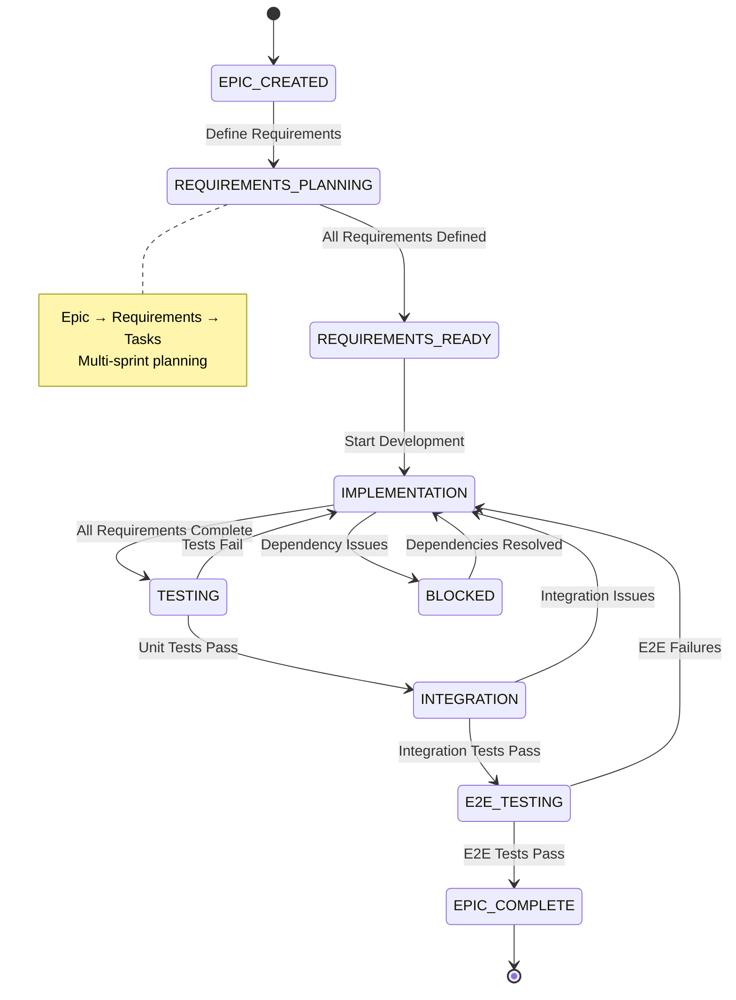

# Epic Development Workflow

## 🏗️ **Epic Development State Diagram**



## 📋 **Epic Lifecycle Phases**

### **EPIC_CREATED**

**Purpose**: Initial epic conception and high-level scoping

**Activities**:

- Create epic overview document
- Define epic scope and boundaries
- Identify key stakeholders
- Establish success criteria

**CLI Commands**:

```bash
# Create new epic
sc kanban new epic "User Authentication System"

# Generate epic overview
sc kanban show epic-auth-system --overview
```

**Deliverables**:

- Epic overview document (`supernal-coding/kanban/epics/epic-name/epic-overview.md`)
- Initial scope definition
- Stakeholder identification
- High-level timeline estimate

### **REQUIREMENTS_PLANNING**

**Purpose**: Break down epic into implementable requirements

**Activities**:

- Identify all functional requirements
- Create detailed requirement specifications
- Define requirement dependencies
- Establish acceptance criteria for each requirement

**CLI Commands**:

```bash
# Create requirements for epic
sc kanban new requirement "User Registration" --epic="auth-system"
sc kanban new requirement "User Login" --epic="auth-system"
sc kanban new requirement "Password Reset" --epic="auth-system"

# Link requirements to epic
sc kanban link req-001 --to-epic="auth-system"
```

**Best Practices**:

- Use [Gherkin format](./requirements) for requirement specifications
- Ensure requirements are testable and measurable
- Define clear boundaries between requirements
- Identify cross-requirement dependencies

### **REQUIREMENTS_READY**

**Purpose**: All requirements defined and ready for implementation

**Criteria**:

- [ ] All requirements identified and documented
- [ ] Acceptance criteria defined for each requirement
- [ ] Dependencies mapped and resolved
- [ ] Technical approach validated
- [ ] Requirement priorities established

**Validation Commands**:

```bash
# Validate epic completeness
sc validate epic auth-system --requirements

# Check dependency graph
sc kanban dependencies --epic="auth-system" --visualize
```

### **IMPLEMENTATION**

**Purpose**: Active development across requirements

**Activities**:

- Implement requirements in priority order
- Create tasks for each requirement
- Track progress across multiple sprints
- Handle blockers and dependency issues

**Multi-Sprint Planning**:

```bash
# Plan sprint allocation
sc kanban plan-sprint 2025-01 --epic="auth-system" --capacity=80

# Track epic progress
sc kanban progress epic auth-system --by-sprint
```

**Progress Tracking**:

- Requirement completion percentage
- Sprint burndown charts
- Velocity metrics per requirement
- Blocker identification and resolution time

### **TESTING**

**Purpose**: Validate individual requirement implementations

**Testing Types**:

- **Unit Testing**: Individual component testing
- **Integration Testing**: Cross-component testing
- **Feature Testing**: End-to-end requirement validation
- **Regression Testing**: Ensure existing functionality preserved

**CLI Commands**:

```bash
# Run requirement-specific tests
sc test requirement REQ-001 --coverage

# Generate test report for epic
sc test epic auth-system --report
```

### **INTEGRATION**

**Purpose**: Validate requirements work together as intended

**Activities**:

- Cross-requirement integration testing
- System-level validation
- Performance testing under realistic load
- Security validation across the epic

**Integration Patterns**:

```bash
# Integration test suite
sc test integration --epic="auth-system"

# Performance validation
sc test performance --epic="auth-system" --load-profile=realistic
```

### **E2E_TESTING**

**Purpose**: Complete epic validation in production-like environment

**E2E Scenarios**:

- Complete user journeys across all requirements
- Edge case and error condition handling
- Performance under production load
- Security penetration testing

**CLI Commands**:

```bash
# Run complete E2E test suite
sc test e2e --epic="auth-system" --environment=staging

# Generate epic completion report
sc report epic auth-system --completion-status
```

### **EPIC_COMPLETE**

**Purpose**: Epic delivered and ready for production

**Completion Criteria**:

- [ ] All requirements implemented and tested
- [ ] Integration tests passing
- [ ] E2E tests passing
- [ ] Documentation complete
- [ ] Security review passed
- [ ] Performance requirements met
- [ ] Stakeholder acceptance achieved

## 🚀 **Epic Management Commands**

### **Epic Creation and Setup**

```bash
# Create epic with initial requirements
sc kanban new epic "Epic Name" \
  --description="Epic description" \
  --requirements="req1,req2,req3" \
  --priority=high

# Generate epic structure
sc kanban generate epic-structure auth-system
```

### **Requirement Management**

```bash
# Add requirement to existing epic
sc kanban add-requirement "New Requirement" \
  --epic="auth-system" \
  --priority=medium

# Reorder requirements within epic
sc kanban reorder epic auth-system \
  --requirements="req-001,req-003,req-002"
```

### **Progress Tracking**

```bash
# Epic dashboard
sc kanban dashboard epic auth-system

# Sprint progress for epic
sc kanban sprint-progress --epic="auth-system" --sprint="2025-01"

# Epic burndown chart
sc kanban burndown epic auth-system --chart=true
```

### **Dependency Management**

```bash
# Visualize epic dependencies
sc kanban dependencies epic auth-system --format=mermaid

# Check blocking dependencies
sc kanban blockers epic auth-system --critical-path
```

## 📊 **Epic Metrics and KPIs**

### **Progress Metrics**

- **Requirements Completion**: Percentage of requirements marked done
- **Sprint Velocity**: Requirements completed per sprint
- **Burndown Rate**: Progress toward epic completion over time
- **Scope Creep**: Requirements added after REQUIREMENTS_READY

### **Quality Metrics**

- **Test Coverage**: Percentage of epic covered by automated tests
- **Defect Rate**: Issues found per requirement
- **Rework Rate**: Requirements requiring significant changes post-implementation
- **Integration Issues**: Problems found during integration phase

### **Timeline Metrics**

- **Epic Duration**: Total time from creation to completion
- **Phase Duration**: Time spent in each epic phase
- **Dependency Delay**: Time lost due to external dependencies
- **Scope Change Impact**: Timeline effect of requirement changes

## 🎯 **Epic Planning Best Practices**

### **Scope Definition**

- **Clear Boundaries**: Define what's included and excluded
- **Success Criteria**: Measurable epic completion criteria
- **Stakeholder Alignment**: Ensure all stakeholders agree on scope
- **Risk Assessment**: Identify and plan for major risks

### **Requirement Breakdown**

- **Vertical Slicing**: Break down by user value, not technical layers
- **Independent Requirements**: Minimize cross-requirement dependencies
- **Testable Specifications**: Each requirement must be verifiable
- **Progressive Elaboration**: Start high-level, add detail as needed

### **Sprint Planning**

- **Dependency Ordering**: Implement dependencies first
- **Risk-First Approach**: Address highest-risk requirements early
- **Capacity Planning**: Match requirement complexity to team capacity
- **Buffer Management**: Leave capacity for unknowns and integration

### **Quality Assurance**

- **Test-First Development**: Define tests before implementation
- **Continuous Integration**: Automated testing at every commit
- **Regular Reviews**: Sprint reviews and retrospectives
- **Documentation Currency**: Keep documentation updated with implementation

## 🔄 **Epic Templates**

### **Epic Overview Template**

```markdown
# Epic: [Epic Name]

## Vision

[1-2 sentence epic vision]

## Success Criteria

- [ ] [Measurable outcome 1]
- [ ] [Measurable outcome 2]

## Requirements

- REQ-001: [Requirement title]
- REQ-002: [Requirement title]

## Timeline

- **Start**: [Date]
- **MVP**: [Date]
- **Complete**: [Date]

## Risks

- **[Risk]**: [Mitigation strategy]
```

## 🚨 **Epic Risk Management**

### **Common Epic Risks**

- **Scope Creep**: Requirements added during implementation
- **Technical Debt**: Shortcuts taken that affect future work
- **Dependency Delays**: External dependencies block progress
- **Resource Changes**: Team members unavailable during epic
- **Integration Complexity**: Unforeseen cross-requirement issues

### **Risk Mitigation Strategies**

- **Regular Scope Reviews**: Weekly scope validation meetings
- **Technical Debt Tracking**: Explicit tracking and paydown planning
- **Dependency Management**: Early identification and stakeholder engagement
- **Cross-Training**: Multiple team members familiar with each requirement
- **Integration Planning**: Early integration testing and validation

---

Epic development ensures large initiatives are successfully delivered through structured planning, implementation, and validation phases.
