# Workflow State Diagrams

This document contains Mermaid state diagrams that visualize the workflow processes for the Supernal Coding system.

## 🔄 Automatic Requirement Git Integration Flow (REQ-045)

```mermaid
graph TD
    A["User runs 'sc req' command"] --> B{Command Type?}

    B -->|"new, update"| C["WRITE Operation"]
    B -->|"show, list, validate"| D["READ Operation"]

    C --> E["Execute req command logic"]
    E --> F["✅ Command completes successfully"]
    F --> G["🔄 AUTO: Background git integration"]
    G --> H["Check current branch"]
    H --> I["Stash non-req changes"]
    I --> J["Switch to main"]
    J --> K["Commit requirement to main"]
    K --> L["Push to origin/main"]
    L --> M["Switch back to feature branch"]
    M --> N["Restore stashed changes"]
    N --> O["✅ Silent completion"]

    D --> P["🔄 AUTO: Check if sync needed"]
    P --> Q{Requirements outdated?}
    Q -->|"Yes"| R["Sync latest from main"]
    Q -->|"No"| S["Execute req command logic"]
    R --> S
    S --> T["✅ Command completes with latest data"]

    G --> Z1["❌ Git operation fails"]
    Z1 --> Z2["Log error + continue"]
    Z2 --> Z3["User sees: 'Warning: Could not sync requirements'"]
    Z3 --> Z4["Primary command still succeeds"]

    style A fill:#e1f5fe
    style G fill:#e8f5e8
    style P fill:#e8f5e8
    style O fill:#c8e6c9
    style T fill:#c8e6c9
    style Z1 fill:#ffcdd2
    style Z4 fill:#fff3e0
```

**Key Integration Points:**

- **WRITE operations** (`sc req new`, `sc req update`): Auto-commit to main AFTER command succeeds
- **READ operations** (`sc req show`, `sc req list`): Auto-sync from main BEFORE command executes
- **ALL operations**: Completely transparent to user, primary command always succeeds
- **ERROR handling**: Git failures never block requirement commands

## 🔄 Main Workflow Decision Tree

## 🎯 Task Lifecycle States

## 🏗️ Epic Development Workflow

## 📋 Requirement Workflow

```mermaid
stateDiagram-v2
    [*] --> REQ_CREATED
    REQ_CREATED --> GHERKIN_WRITING : Write Scenarios
    GHERKIN_WRITING --> TEST_GENERATION : Generate Test Stubs
    TEST_GENERATION --> IMPLEMENTATION : Create Tasks
    IMPLEMENTATION --> UNIT_TESTING : Code Complete
    UNIT_TESTING --> INTEGRATION_TESTING : Unit Tests Pass
    INTEGRATION_TESTING --> REQ_COMPLETE : Integration Tests Pass
    REQ_COMPLETE --> [*]

    UNIT_TESTING --> IMPLEMENTATION : Unit Tests Fail
    INTEGRATION_TESTING --> IMPLEMENTATION : Integration Tests Fail
    IMPLEMENTATION --> BLOCKED : Dependencies Missing
    BLOCKED --> IMPLEMENTATION : Dependencies Ready

    note right of GHERKIN_WRITING
        Requirement → Gherkin → Tests
        Sprint-based delivery
    end note
```

## 🔄 Handoff Management States

## 🧪 Test Completion Decision Flow

## 🚨 Priority-Based Workflow Routing

```mermaid
graph TD
    A[Work Item Created] --> B{Priority Analysis}
    B --> C[P0 - Critical]
    B --> D[P1 - High]
    B --> E[P2 - Medium]
    B --> F[P3 - Low]
    B --> G[P4 - Future]

    C --> H[Immediate Action<br/>Skip Planning]
    D --> I[Quick Planning<br/>1 Week Timeline]
    E --> J[Standard Planning<br/>2 Week Timeline]
    F --> K[Detailed Planning<br/>1 Month Timeline]
    G --> L[Research & Document<br/>Next Quarter]

    H --> M[Implement → Test → Deploy]
    I --> N[Plan → Implement → Test]
    J --> O[Plan → Implement → Test → Review]
    K --> P[Plan → Implement → Test → Polish]
    L --> Q[Research → Plan → Future Queue]

    style C fill:#ffebee
    style D fill:#fff3e0
    style E fill:#e8f5e8
    style F fill:#e3f2fd
    style G fill:#f3e5f5
```

## 🔄 Branch Management Workflow

## 📊 Approval Escalation Flow

## 🎯 Decision Tree Integration

---

_These diagrams provide visual representations of the workflow states and transitions, making it easier to understand and follow the system processes._
