# SOP-000: Complete Development Workflow

## Purpose

End-to-end development process from business discovery through production deployment. Organized around natural work breakdown hierarchy: Milestone → Epic → Feature → Task → Component.

## Key Principles

1. **Hierarchical Breakdown**: Milestone → Epic → Feature → Task → Component
2. **Approval Gates**: Clear sign-offs at each level
3. **Compliance Everywhere**: Security and compliance integrated at all stages
4. **Human-AI Collaboration**: AI assists; humans approve and decide
5. **Iterative**: Each phase allows for human evaluation and iteration

---

## Overview: 12-Phase Process

| Phase        | Quality Gate                                                                       | Responsible                        |
| ------------ | ---------------------------------------------------------------------------------- | ---------------------------------- |
| **Phase 1**  | Business analyzed to find discovery "We found something that needs a solution!"    | Business Team                      |
| **Phase 2**  | Research, user stories collected model approved "What might solve this?"           | Product Owner + Architect          |
| **Phase 3**  | Architecture and approximate domain (UI and Backend): "How should we make this?"   | Architect + Security Lead          |
| **Phase 3b** | Compliance plan: "How should we make this safely?"                                 | Compliance Officer + Security Lead |
| **Phase 4**  | Planning and breakdown of features, tasks, and epics: "When will we make what?"    | Product Owner + Architect          |
| **Phase 5**  | Technical requirements created, specific domain modeling (per feature)             | Product Owner + Tech Lead          |
| **Phase 6**  | Tests created and validated (per feature)                                          | QA Team + Developers               |
| **Phase 7**  | Components built and tested to pass tests (per feature)                            | Developers + AI                    |
| **Phase 8**  | Integration of features into epics. E2E tests completed. Security tests completed. | QA Team + Security Lead            |
| **Phase 9**  | Integration of epics into milestones                                               | Tech Lead + Product Owner          |
| **Phase 10** | Deployment to staging environment. AI agentic testing completed.                   | Ops Team + QA Team                 |
| **Phase 11** | Production deployment approved                                                     | Ops Lead + Stakeholders            |
| **Phase 12** | Production monitoring stable (Ongoing)                                             | Ops Team                           |

---

## Complete Workflow Diagram

```mermaid
graph TD
    %% PHASE 1: DISCOVERY
    P1["Phase 1: What did we find?<br/>👤 Business Team + 🤖 AI<br/>Evidence & opportunities"]

    %% PHASE 2: RESEARCH & STORIES
    P1 --> P2["Phase 2: Research and Modeling <br/> <i> What should we build?</i> <br/>👤 PO + Architect + 🤖 AI<br/>Stories + Domain model"]
    P2 --> G2{✅ Approved?}
    G2 -->|No| P2

    %% PHASE 3 & 3b: PARALLEL DESIGN
    G2 -->|Yes| P3

    subgraph DESIGN["Phase 3: Design "]
        P3["3a: <i>How do we build it?</i><br/>👤 Architect + 🤖 AI<br/>System design + ADRs"]
        P3B["3b: <i>How do we build safely?</i><br/>👤 Compliance + Security + 🤖 AI<br/>Compliance + Security controls"]
        P3 -.Collaborate.-> P3B
    end

    P3B --> G3{❓✅}
    G3 -->|No| P3

    %% PHASE 4: COLLABORATION CHECKPOINT
    G3 -->|Needs revision| P2
    G3 -->|Yes| P4{{"Phase 4: Planning <br/> <i> When will we build what?<i> <br/>📋 PO + Arch + Compliance + Security"}}
    P4 --> BACKLOG

    %% BACKLOG (ONGOING)
    BACKLOG[("Product Backlog<br/>🔄 PO")]

    %% MILESTONE/EPIC/FEATURE HIERARCHY
    BACKLOG --> P5

    subgraph MILESTONE["MILESTONE SCOPE"]
        subgraph EPIC["EPIC SCOPE - Repeat per Epic (can run in parallel)"]
            subgraph FEATURE["FEATURE SCOPE - Repeat per Feature (can run in parallel)"]
                P5["Phase 5: What exactly to build?<br/>👤 PO + Tech Lead + 🤖 AI<br/>Requirements + Gherkin"]
                P5 --> G5{✅}
                G5 -->|No| P5
                G5 -->|Yes| P6["Phase 6: How do we test it?<br/>👤 QA + Dev + 🤖 AI<br/>E2E + Unit tests"]
                P6 --> P7["Phase 7: Build it!<br/>👤 Dev + 🤖 AI Pair<br/>Code passing tests"]
                P7 --> G7{✅}
                G7 -->|No| P6
            end

            G7 -->|Yes| P8["Phase 8: Do features work together?<br/>👤 QA + Security + 🤖 AI<br/>Integrated epic + Security scan"]
            P8 --> G8{❓✅}
            G8 -->|Issues found| P5
            G8 -->|Yes| P9_ENTRY[" "]
        end

        P9_ENTRY --> P9{{"Phase 9: Do epics achieve milestone?<br/>📋 Tech Lead + PO"}}
        P9 -->|Needs work| P5
        P9 -.⟲ Next Epic in parallel.-> P5
    end

    %% DEPLOYMENT PHASES
    P9 -->|Yes| P10["Phase 10: Staging + Security Scan<br/>👤 Ops + QA + Security + 🤖 AI<br/>Staging validated + Vuln scan"]
    P10 --> G10{❓✅}
    G10 -->|Yes| P11["Phase 11: Deploy to production<br/>👤 Ops + Stakeholders<br/>Live release"]
    G10 -->|Issues found| P4

    P11 --> P12["Phase 12: Is it healthy?<br/>👤 Ops + 🤖 AI Monitor<br/>🔄 Ongoing"]
    P12 -.Issues found.-> P4
    P12 -.New need identified.-> P1
    %% STYLING - MUCH DARKER BACKGROUNDS FOR READABILITY
    style P1 fill:#1e88e5,stroke:#0d47a1,stroke-width:2px,color:#fff
    style P2 fill:#1e88e5,stroke:#0d47a1,stroke-width:2px,color:#fff
    style P5 fill:#1e88e5,stroke:#0d47a1,stroke-width:2px,color:#fff
    style P6 fill:#1e88e5,stroke:#0d47a1,stroke-width:2px,color:#fff
    style P7 fill:#1e88e5,stroke:#0d47a1,stroke-width:2px,color:#fff
    style P8 fill:#1e88e5,stroke:#0d47a1,stroke-width:2px,color:#fff
    style P10 fill:#1e88e5,stroke:#0d47a1,stroke-width:2px,color:#fff
    style P11 fill:#1e88e5,stroke:#0d47a1,stroke-width:2px,color:#fff
    style P3 fill:#43a047,stroke:#1b5e20,stroke-width:2px,color:#fff
    style P3B fill:#43a047,stroke:#1b5e20,stroke-width:2px,color:#fff
    style G2 fill:#66bb6a,stroke:#2e7d32,stroke-width:3px,color:#000
    style G3 fill:#66bb6a,stroke:#2e7d32,stroke-width:3px,color:#000
    style G5 fill:#66bb6a,stroke:#2e7d32,stroke-width:3px,color:#000
    style G7 fill:#66bb6a,stroke:#2e7d32,stroke-width:3px,color:#000
    style G8 fill:#66bb6a,stroke:#2e7d32,stroke-width:3px,color:#000
    style G10 fill:#66bb6a,stroke:#2e7d32,stroke-width:3px,color:#000
    style P4 fill:#1976d2,stroke:#0d47a1,stroke-width:4px,color:#fff
    style P9 fill:#1976d2,stroke:#0d47a1,stroke-width:4px,color:#fff
    style BACKLOG fill:#f57c00,stroke:#e65100,stroke-width:2px,color:#fff
    style P12 fill:#f57c00,stroke:#e65100,stroke-width:2px,color:#fff
    style DESIGN fill:#81c784,stroke:#2e7d32,stroke-width:3px
    style MILESTONE fill:#64b5f6,stroke:#1976d2,stroke-width:3px
    style EPIC fill:#90caf9,stroke:#1565c0,stroke-width:2px
    style FEATURE fill:#bdbdbd,stroke:#616161,stroke-width:2px
    style P9_ENTRY fill:none,stroke:none
```



**Legend**:

- 👤 = Human Role | 🤖 = AI Assistance
- ✅ = Approval Gate (green diamond) with feedback loop if not approved
- 📋 = Collaboration Checkpoint (blue diamond, thick border) - can reject backward
- 🔄 = Ongoing Process (orange circle)
- Solid arrow = Main flow | Dotted arrow = Feedback/Iteration/Loop
- ⟲ = Loop for next item (Features and Epics can be built in parallel)
- Subgraphs show hierarchy and scope boundaries

---

## Sequence Diagrams

### Sequence 1: Discovery to Approved Plan (Phases 1-4)


### Sequence 2: Per-Feature Implementation (Phases 5-7)

```mermaid
sequenceDiagram
    participant PO as Product Owner
    participant TL as Tech Lead
    participant D as Developer
    participant QA as QA Team
    participant AI as AI Assistant

    Note over PO,AI: Phase 5: Technical Requirements (Per Feature)
    PO->>PO: Select feature from backlog
    PO->>AI: Generate requirements from user stories
    AI-->>PO: Requirements with Gherkin scenarios
    PO->>PO: Review and refine requirements

    PO->>AI: Generate API specs and data models
    AI-->>PO: Technical specifications

    PO->>TL: Review for implementability
    TL->>PO: Validate technical approach

    Note over PO,AI: Link Compliance
    PO->>PO: Link compliance requirements to feature
    PO->>PO: Document how feature meets compliance

    Note over PO,AI: ✅ Phase 5 Approval
    PO->>PO: Sign off on requirements
    TL->>TL: Sign off on technical approach

    Note over PO,AI: Phase 6: Tests Created (BDD/TDD)
    QA->>AI: Generate E2E tests from Gherkin
    AI-->>QA: E2E test code
    QA->>QA: Review and validate E2E tests

    D->>AI: Generate unit tests from requirements
    AI-->>D: Unit test code
    D->>D: Review and validate unit tests

    QA->>QA: Verify tests currently fail (no implementation)

    Note over PO,AI: Phase 7: Components Built (AI Pair Programming)

    loop AI Pair Programming (3-5 iterations)
        D->>AI: Prompt with context (requirements, tests, design)
        AI-->>D: Code implementation
        D->>D: Review generated code
        D->>D: Run tests
        alt Tests Fail
            D->>AI: Provide feedback and refinements
        else Tests Pass
            D->>D: Move to code review
        end
    end

    Note over PO,AI: Code Review
    D->>AI: Request automated code review
    AI-->>D: Code analysis (style, security, performance)
    D->>TL: Request human review
    TL->>TL: Review code and AI analysis

    loop Until Approved
        TL->>D: Provide feedback
        D->>D: Address comments
        D->>TL: Request re-review
    end

    Note over PO,AI: ✅ Phase 7 Approval
    TL->>TL: Approve code
    D->>D: Merge feature branch

    Note over PO,AI: Feature Complete - Ready for Integration
```



### Sequence 3: Integration and Deployment (Phases 8-12)


---

## Detailed Phase Breakdown

### Phase 1: Business Discovery

**Purpose**: Analyze business needs to find opportunities

**Responsible**: Business Team

**Location**: `docs/research_and_analysis/evidence/`

**Activities**:

1. Collect user feedback and pain points
2. Gather market intelligence and competitive analysis
3. Analyze business opportunities
4. Document strategic insights with sources

**AI Assistance**:

- Research market trends
- Analyze competitive landscape
- Identify patterns in user feedback

**Outputs**:

- Market research documents
- User feedback reports
- Competitive analysis
- Business opportunity briefs

**Quality Gate**:

- [ ] Business opportunities identified
- [ ] Evidence documented with sources
- [ ] Business Team approval

---

### Phase 2: Research, User Stories & Domain Model

**Purpose**: Transform business discovery into user stories and high-level domain model

**Responsible**: Product Owner + Architect

**Location**:

- `docs/requirements/stories/{persona}/`
- `docs/research_and_analysis/`

**Activities**:

**Research & Domain Modeling**:

1. Research technical approaches
2. Create approximate domain model (high-level bounded contexts)
3. Identify system capabilities
4. Document feasibility analysis

**User Stories**:

1. Identify user personas
2. Write user stories: "As a [persona], I want [goal], so that [benefit]"
3. Define acceptance criteria
4. Link stories to business evidence
5. Prioritize stories

**AI Assistance**:

- Generate domain model suggestions
- Research technical approaches
- Generate story templates from evidence
- Suggest acceptance criteria

**Outputs**:

- User stories with acceptance criteria
- High-level domain model
- Technical research documents
- Feasibility analysis

**Quality Gate - APPROVED**:

- [ ] User stories complete with acceptance criteria
- [ ] High-level domain model documented
- [ ] Technical approach validated
- [ ] Product Owner approval
- [ ] Architect approval

---

### Phase 3: Architecture (UI and Backend)

**Purpose**: Define system architecture - "How should we make this?"

**Responsible**: Architect + Security Lead

**Location**: `docs/reference/architecture/`

**Activities**:

**Backend Architecture**:

1. Design system components and services
2. Define API contracts and data flows
3. Create architecture diagrams (system context, component, data flow)
4. Document Architecture Decision Records (ADRs)
5. Specify integration patterns

**Frontend Architecture**:

1. Design UI architecture and component structure
2. Define state management approach
3. Specify UI-API contracts
4. Document design system principles
5. Define responsive and accessibility patterns

**AI Assistance**:

- Generate architecture diagrams
- Suggest design patterns
- Identify architectural risks
- Generate ADRs

**Outputs**:

- Architecture Decision Records (ADRs)
- System architecture diagrams
- Component specifications
- API contracts
- Data models

**Quality Gate**:

- [ ] Backend architecture complete
- [ ] Frontend architecture complete
- [ ] Architecture diagrams created
- [ ] ADRs documented
- [ ] Integration patterns defined

---

### Phase 3b: Compliance Plan

**Purpose**: Define compliance approach - "How should we make this safely?"

**Responsible**: Compliance Officer + Security Lead

**Location**: `docs/requirements/compliance/`

**Activities**:

**Compliance Analysis**:

1. Identify applicable regulations (GDPR, HIPAA, SOC2, etc.)
2. Document compliance requirements
3. Define data handling and privacy requirements
4. Establish audit requirements

**Security Planning**:

1. Conduct threat modeling
2. Perform risk assessment
3. Define security controls
4. Document monitoring and response procedures
5. Plan security testing approach

**AI Assistance**:

- Identify potential compliance obligations
- Suggest relevant regulations
- Generate threat model
- Recommend security controls

**Outputs**:

- Compliance Requirements Document
- Threat model
- Security controls specification
- Data handling requirements
- Audit requirements

**Quality Gate - APPROVED**:

- [ ] Applicable regulations identified
- [ ] Compliance requirements documented
- [ ] Threat modeling complete
- [ ] Security controls defined
- [ ] Compliance Officer approval
- [ ] Security Lead approval

---

### Phase 4: Planning & Breakdown

**Purpose**: Break work into epics, features, and tasks - "When will we make what?"

**Responsible**: Product Owner + Architect

**Location**:

- `docs/planning/milestones/`
- `docs/planning/epics/`
- `docs/features/\{domain\}/\{feature\}/`

**Activities**:

**Step 1: Break into Epics**

1. Review user stories and architecture
2. Group related stories into epics
3. Define epic goals and scope
4. Identify epic dependencies
5. Estimate epic effort

**Step 2: Break into Features**

1. Break each epic into features
2. Define feature goals and acceptance criteria
3. Link features to user stories
4. Identify feature dependencies
5. Estimate feature effort

**Step 3: Break into Tasks**

1. Break each feature into implementation tasks
2. Define task specifications
3. Identify task dependencies
4. Assign task owners
5. Estimate task effort

**AI Assistance**:

- Suggest epic breakdown from stories
- Recommend feature groupings
- Generate task breakdown
- Identify dependencies
- Estimate effort

**Outputs**:

- Epic documents with linked features
- Feature documents with linked stories and tasks
- Task documents with specifications
- Dependency maps
- Timeline estimates

**Quality Gate - APPROVED (at appropriate level of detail, compliance included at all stages)**:

- [ ] Epics defined and approved
- [ ] Features defined and approved
- [ ] Tasks defined and approved
- [ ] Dependencies identified
- [ ] Compliance requirements linked at each level
- [ ] Timeline realistic
- [ ] Product Owner approval
- [ ] Architect approval

---

## Per-Feature Implementation (Phases 5-7)

**Note**: Phases 5-7 are executed **for each feature** within an epic. Multiple features may be developed in parallel.

---

### Phase 5: Technical Requirements & Specific Domain Modeling

**Purpose**: Create detailed technical requirements for a specific feature

**Responsible**: Product Owner + Tech Lead

**Location**:

- Feature: `docs/features/\{domain\}/\{feature\}/`
- **Phase**: Set `phase: drafting` in feature frontmatter
- **Documentation structure** (choose based on complexity):
  - **Minimal**: Everything in README.md (simple features)
  - **Growing**: README.md + DESIGN.md, PLANNING.md, REQUIREMENTS.md (medium features)
  - **Complex**: README.md + design/, planning/, requirements/ folders (large features with research, multiple docs, evidence)

**Activities**:

**Technical Requirements**:

1. Review user stories linked to feature
2. Write technical requirements with Gherkin scenarios
3. Define API specifications
4. Specify data schemas
5. Document error handling and edge cases

**Specific Domain Modeling**:

1. Refine domain model for this feature
2. Define entities, value objects, aggregates
3. Specify domain events
4. Document business rules
5. Create domain sequence diagrams

**Compliance Integration**:

1. Link to compliance requirements from Phase 3b
2. Document how feature meets compliance
3. Specify audit logging requirements
4. Define data privacy controls

**AI Assistance**:

- Generate Gherkin scenarios from stories
- Suggest API contracts
- Generate domain model refinements
- Identify edge cases

**Outputs**:

- Technical requirements with Gherkin
- API specifications
- Data schemas
- Refined domain model for feature
- Compliance mapping

**Quality Gate - APPROVED (Compliance plan included)**:

- [ ] Requirements complete with Gherkin
- [ ] Domain model refined for feature
- [ ] API specs defined
- [ ] Compliance requirements linked
- [ ] Product Owner approval
- [ ] Tech Lead approval

---

### Phase 6: Tests Created & Validated

**Purpose**: Write tests BEFORE implementation (BDD/TDD)

**Responsible**: QA Team + Developers

**Location**:

- Feature: `docs/features/\{domain\}/\{feature\}/`
- **Phase**: Set `phase: implementing` in feature frontmatter
- **Documentation structure** (add testing documentation):
  - **Minimal**: Add "Testing" section to README.md
  - **Growing**: Add TESTING.md sibling file
  - **Complex**: Create testing/ folder (for test plans, results, coverage reports, evidence)

**Activities**:

**E2E Test Development**:

1. Review Gherkin scenarios from Phase 5
2. Generate E2E test specifications
3. Write E2E test code
4. Define test data requirements

**Unit Test Development**:

1. Review technical requirements
2. Generate unit test specifications
3. Write unit test code
4. Create mocks and fixtures

**Test Validation**:

1. Review tests against requirements
2. Ensure test coverage is adequate
3. Verify tests fail (no implementation yet)
4. Document test strategy

**AI Assistance**:

- Generate test code from Gherkin
- Suggest edge case tests
- Generate unit test templates
- Identify coverage gaps

**Outputs**:

- E2E test files
- Unit test files
- Test data and fixtures
- Test coverage report

**Quality Gate**:

- [ ] E2E tests written for all scenarios
- [ ] Unit tests written for all functions
- [ ] Test coverage adequate
- [ ] Tests validated (currently failing)
- [ ] QA Team approval

---

### Phase 7: Components Built & Tested to Success

**Purpose**: Implement code to pass tests

**Responsible**: Developers + AI

**Location**:

- Feature: `docs/features/\{domain\}/\{feature\}/`
- Code: Actual codebase (not in docs/)
- **Phase**: Feature stays at `phase: implementing` in frontmatter
- **Required structure**: Same as Phase 6 (README.md or directories based on feature size)

**Activities**:

**AI-Human Pair Programming** (3-5 iterations):

1. Developer prompts AI with context (requirements, design, tests)
2. AI generates initial implementation
3. Developer reviews generated code
4. Developer runs tests
5. Developer provides feedback to AI
6. AI generates updated code
7. Repeat until tests pass

**Implementation**:

- Create UI components (if frontend feature)
- Implement backend services (if backend feature)
- Ensure all unit tests pass
- Ensure all E2E tests pass
- Follow coding standards

**Code Review**:

1. Developer opens Pull Request
2. AI analyzes code (style, security, performance)
3. 2 human reviewers validate and approve
4. Developer addresses feedback
5. All automated checks pass

**AI Assistance**:

- Generate code implementation
- Suggest optimizations
- Identify security issues
- Analyze code quality

**Outputs**:

- Implemented code (UI and/or Backend)
- All tests passing
- Code review approvals
- Implementation notes

**Quality Gate - APPROVED**:

- [ ] All unit tests passing
- [ ] All E2E tests passing
- [ ] Code review approved (2 reviewers)
- [ ] Coding standards met
- [ ] Security scan passed
- [ ] Tech Lead approval

**Phase Transition**: Update frontmatter `phase: implementing` → `phase: testing` when ready for integration.

---

## Integration & Deployment (Phases 8-12)

---

### Phase 8: Integration of Features into Epics

**Purpose**: Integrate completed features, run E2E and security tests

**Responsible**: QA Team + Security Lead

**Location**:

- Features: `docs/features/\{domain\}/\{feature\}/`
- **Phase**: Features have `phase: testing` in frontmatter
- **Required directories**: `design/`, `planning/`, `requirements/`, `testing/`

**Activities**:

**Feature Integration**:

1. Merge feature branches for all completed features in epic
2. Deploy integrated build to integration environment
3. Verify feature interactions

**E2E Testing**:

1. Run full E2E test suite across integrated features
2. Test user journeys that span multiple features
3. Verify data flows between features
4. Test error handling across features

**Security Testing**:

1. Run security scans (SAST, DAST)
2. Perform penetration testing
3. Verify security controls from Phase 3b
4. Test authentication and authorization
5. Validate compliance requirements

**AI Assistance**:

- Analyze test failures
- Identify integration issues
- Generate security test reports
- Suggest fixes

**Outputs**:

- Integrated epic build
- E2E test results
- Security test results
- Integration test reports

**Quality Gate**:

- [ ] All features integrated successfully
- [ ] E2E tests passing across features
- [ ] Security tests passing
- [ ] No critical vulnerabilities
- [ ] Compliance requirements validated
- [ ] QA Team approval
- [ ] Security Lead approval

**Epic Status**: Epic ready for milestone integration

---

### Phase 9: Integration of Epics into Milestones

**Purpose**: Integrate completed epics into milestone

**Responsible**: Tech Lead + Product Owner

**Location**: `docs/planning/milestones/`

**Activities**:

**Epic Integration**:

1. Merge epic branches into milestone branch
2. Verify no conflicts between epics
3. Run full regression test suite
4. Validate milestone goals are met

**Milestone Validation**:

1. Review all epic completions
2. Verify milestone acceptance criteria
3. Check business goals are achieved
4. Validate against original plan

**AI Assistance**:

- Analyze regression test results
- Identify conflicts between epics
- Validate milestone completeness

**Outputs**:

- Integrated milestone build
- Regression test results
- Milestone completion report

**Quality Gate**:

- [ ] All epics integrated
- [ ] Regression tests passing
- [ ] Milestone goals achieved
- [ ] Business value validated
- [ ] Tech Lead approval
- [ ] Product Owner approval

**Milestone Status**: Ready for staging deployment

---

### Phase 10: Staging Deployment & AI Agentic Testing

**Purpose**: Deploy to staging, run comprehensive AI-driven testing

**Responsible**: Ops Team + QA Team

**Location**:

- Feature: `docs/features/\{domain\}/\{feature\}/`
- **Phase**: Features have `phase: testing` or `phase: validating` in frontmatter
- **Documentation structure** (add validation documentation):
  - **Minimal**: Add "Validation" section to README.md
  - **Growing**: Add VALIDATION.md sibling file
  - **Complex**: Create validation/ folder (for checklists, sign-offs, audit evidence)

**Activities**:

**Staging Deployment**:

1. Deploy milestone to staging environment
2. Run smoke tests
3. Verify all services healthy
4. Configure monitoring

**AI Agentic Testing**:

1. AI explores application like a user
2. AI generates and executes test scenarios
3. AI tests edge cases and unexpected paths
4. AI performs load and performance testing
5. AI validates user journeys

**Manual QA**:

1. Cross-browser testing
2. Device testing (mobile, tablet, desktop)
3. Accessibility testing
4. Usability testing

**AI Assistance**:

- Execute autonomous exploratory testing
- Generate dynamic test scenarios
- Analyze performance metrics
- Identify UX issues

**Outputs**:

- Staging deployment successful
- AI testing reports
- Manual QA reports
- Performance test results

**Quality Gate - APPROVED**:

- [ ] Staging deployment successful
- [ ] AI agentic testing complete with no critical issues
- [ ] Manual QA passed
- [ ] Performance acceptable
- [ ] Ops Team approval
- [ ] QA Team approval

**Milestone Status**: Ready for production deployment

---

### Phase 11: Production Deployment

**Purpose**: Deploy milestone to production

**Responsible**: Ops Lead + Stakeholders

**Location**:

- Features: `docs/features/\{domain\}/\{feature\}/`
- **Phase**: Update frontmatter to `phase: complete` after deployment

**Activities**:

**Pre-Deployment**:

1. Create release notes
2. Prepare rollback plan
3. Review deployment checklist
4. Schedule deployment window
5. Notify stakeholders

**Deployment**:

1. Execute deployment (blue-green or canary)
2. Run health checks
3. Verify production functionality
4. Monitor for issues
5. Execute rollback if necessary

**Post-Deployment**:

1. Validate production deployment
2. Monitor metrics closely
3. Respond to any issues
4. Update documentation

**AI Assistance**:

- Generate release notes
- Monitor deployment health
- Alert on anomalies

**Outputs**:

- Production deployment complete
- Release notes
- Deployment documentation

**Quality Gate - APPROVED**:

- [ ] Stakeholder approval obtained
- [ ] Deployment successful
- [ ] Health checks passing
- [ ] No critical issues
- [ ] Ops Lead approval
- [ ] Stakeholder approval

**Milestone Status**: Live in production

---

### Phase 12: Production Monitoring (Ongoing)

**Purpose**: Continuous monitoring and support

**Responsible**: Ops Team

**Location**: Production environment

**Activities**:

**Monitoring**:

1. Monitor application metrics (response times, error rates, etc.)
2. Track user behavior and adoption
3. Monitor infrastructure health
4. Track business metrics

**Support**:

1. Respond to production issues
2. Triage and route support tickets
3. Coordinate hotfixes if needed
4. Gather user feedback

**Analysis**:

1. Analyze patterns and trends
2. Identify improvement opportunities
3. Detect anomalies
4. Generate insights

**AI Assistance**:

- Automated monitoring and alerting
- Anomaly detection
- Support ticket analysis and routing
- Pattern identification

**Outputs**:

- Production health dashboards
- Support tickets and resolutions
- Monitoring reports
- Improvement recommendations

**Quality Gate - ONGOING**:

- [ ] Monitoring stable
- [ ] Response times acceptable
- [ ] Error rates low
- [ ] User satisfaction high

**Feedback Loops**:

- Issues → Back to Phase 5 (new feature to fix)
- New features → Back to Phase 1 (new discovery)
- Changes → Change Control → Appropriate phase

---

## Hierarchy & Traceability

```
Business Discovery (Phase 1)
  ↓
User Stories (Phase 2)
  ↓
┌─────────────────────────────────────┐
│ Milestone                           │
│ ├─ Epic 1                           │
│ │  ├─ Feature 1 (Phases 5-7)       │
│ │  │  ├─ Task 1                    │
│ │  │  ├─ Task 2                    │
│ │  │  └─ Task 3                    │
│ │  └─ Feature 2 (Phases 5-7)       │
│ │     ├─ Task 4                    │
│ │     └─ Task 5                    │
│ │  [Phase 8: Integrate Features]   │
│ ├─ Epic 2                           │
│ │  ├─ Feature 3 (Phases 5-7)       │
│ │  └─ Feature 4 (Phases 5-7)       │
│ │  [Phase 8: Integrate Features]   │
│ [Phase 9: Integrate Epics]         │
└─────────────────────────────────────┘
  ↓
Phase 10: Staging
  ↓
Phase 11: Production
  ↓
Phase 12: Monitoring (Ongoing)
```

---

## Compliance Integration

**Compliance is included at ALL stages**:

- **Phase 2**: Identify compliance obligations
- **Phase 3b**: Define compliance plan and security controls
- **Phase 4**: Link compliance to epics, features, tasks
- **Phase 5**: Map compliance requirements to technical requirements
- **Phase 6**: Include compliance validation tests
- **Phase 7**: Implement compliance controls
- **Phase 8**: Test security and compliance
- **Phase 10**: Validate compliance in staging
- **Phase 11**: Final compliance check before production
- **Phase 12**: Ongoing compliance monitoring

---

## Key Approval Gates

| Phase    | Approval Required From             | Purpose                                           |
| -------- | ---------------------------------- | ------------------------------------------------- |
| Phase 2  | Product Owner + Architect          | User stories and domain model approved            |
| Phase 3b | Compliance Officer + Security Lead | Compliance plan and security approach approved    |
| Phase 4  | Product Owner + Architect          | Epics, features, tasks breakdown approved         |
| Phase 5  | Product Owner + Tech Lead          | Technical requirements approved (per feature)     |
| Phase 7  | Tech Lead                          | Code implementation approved (per feature)        |
| Phase 8  | QA Team + Security Lead            | Feature integration and security testing approved |
| Phase 9  | Tech Lead + Product Owner          | Epic integration into milestone approved          |
| Phase 10 | Ops Team + QA Team                 | Staging deployment and testing approved           |
| Phase 11 | Ops Lead + Stakeholders            | Production deployment approved                    |

---

## Related Documents

- **SOP-001**: Epic & Milestone Management
- **SOP-002**: Requirements Management (Gherkin, Stories)
- **SOP-003**: Architecture & Design Process
- **SOP-004**: Development & Testing Process
- **SOP-005**: Security & Compliance Integration
- **SOP-006**: Deployment & Operations

---

**Status**: 🚧 DRAFT v4.0 - Hierarchical breakdown structure
**Next**: Add sequence diagrams for hierarchical flow
