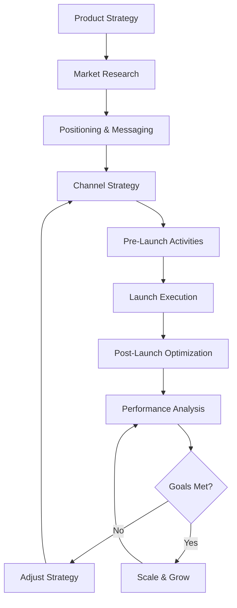

# SOP-12.01: Marketing & Launch

## Purpose

This SOP defines marketing processes for software products, including lead generation, communication channels, launch planning, and metrics tracking.

## Scope

- Marketing strategy and planning
- Lead generation and nurturing
- Communication channels
- Launch activities (pre-launch, launch, post-launch)
- Marketing metrics and analytics

---

## Process Overview



---

## Phase 1: Market Research & Strategy

### 1.1 Target Market Definition

**Human Role**: Marketing Lead, Product Owner

**AI Assistance**:

- Market size analysis
- Competitor research
- Trend identification

**Process**:

1. **Define Ideal Customer Profile (ICP)**
   - Industry vertical
   - Company size
   - Pain points
   - Budget range
   - Decision-making process

2. **Market Segmentation**
   - Primary segment (focus)
   - Secondary segments (opportunities)
   - Segment prioritization

3. **Competitive Analysis**
   - Direct competitors
   - Indirect competitors
   - Competitive advantages
   - Market positioning

**Output**: Market research document with ICP and competitive analysis

---

## Phase 2: Positioning & Messaging

### 2.1 Value Proposition Development

**Framework**: Value Proposition Canvas

**Components**:

1. **Customer Jobs** (what customers need to accomplish)
2. **Pains** (obstacles and risks)
3. **Gains** (desired outcomes and benefits)
4. **Products & Services** (what you offer)
5. **Pain Relievers** (how you solve problems)
6. **Gain Creators** (how you create benefits)

**Example**:

```markdown
## Value Proposition for [Product Name]

**For**: [Target Customer]
**Who**: [Customer Need]
**Our Product**: [Product Category]
**That**: [Key Benefit]
**Unlike**: [Competitor]
**Our Product**: [Key Differentiator]
```

### 2.2 Messaging Framework

**Components**:

1. **Headline**: One-sentence description
2. **Subheadline**: 2-3 sentences explaining value
3. **Key Benefits**: 3-5 main benefits
4. **Features**: Supporting capabilities
5. **Social Proof**: Testimonials, case studies

**Output**: Messaging framework document

---

## Phase 3: Channel Strategy

### 3.1 Marketing Channels

**Select Appropriate Channels** based on ICP:

#### Digital Channels

1. **Website/Landing Page**
   - Primary conversion point
   - SEO optimization
   - Clear CTAs

2. **Content Marketing**
   - Blog posts
   - Technical tutorials
   - Case studies
   - Whitepapers

3. **Social Media**
   - LinkedIn (B2B)
   - Twitter/X (Tech community)
   - Reddit (Technical discussions)
   - YouTube (Demos, tutorials)

4. **Email Marketing**
   - Newsletter
   - Drip campaigns
   - Product updates
   - Personalized outreach

5. **Paid Advertising**
   - Google Ads
   - LinkedIn Ads
   - Retargeting campaigns

6. **Developer Relations**
   - GitHub presence
   - Open source contributions
   - Technical blog posts
   - Conference talks

#### Traditional Channels

1. **Events & Conferences**
   - Booth presence
   - Speaking opportunities
   - Networking

2. **Partner Marketing**
   - Co-marketing campaigns
   - Integration partnerships
   - Referral programs

3. **PR & Media**
   - Press releases
   - Media outreach
   - Industry publications

---

## Phase 4: Lead Generation

### 4.1 Lead Generation Strategies

#### Inbound Marketing

1. **Content Strategy**
   - Educational content addressing customer pain points
   - SEO-optimized blog posts
   - Downloadable resources (ebooks, templates)
   - Video tutorials and demos

2. **Lead Magnets**
   - Free trial/demo
   - Free tier (freemium)
   - Templates/tools
   - Technical guides

3. **Website Optimization**
   - Clear value proposition
   - Strong CTAs
   - Conversion-optimized forms
   - Fast page load times

#### Outbound Marketing

1. **Email Outreach**
   - Personalized cold emails
   - LinkedIn InMail
   - Email sequences

2. **Account-Based Marketing (ABM)**
   - Target high-value accounts
   - Personalized campaigns
   - Multi-channel approach

### 4.2 Lead Qualification

**Framework**: BANT (Budget, Authority, Need, Timeline)

**Process**:

1. **Lead Capture**
   - Form submissions
   - Demo requests
   - Trial signups

2. **Lead Scoring**
   - Demographic fit (ICP match)
   - Engagement level (email opens, site visits)
   - Behavior signals (pricing page views)

3. **Lead Routing**
   - Marketing Qualified Leads (MQL) → nurturing
   - Sales Qualified Leads (SQL) → sales team

---

## Phase 5: Marketing Automation

### 5.1 Marketing Tech Stack

**Core Tools**:

1. **CRM** (Customer Relationship Management)
   - HubSpot, Salesforce, Pipedrive
   - Lead tracking
   - Pipeline management

2. **Marketing Automation**
   - Email sequences
   - Lead scoring
   - Behavior tracking

3. **Analytics**
   - Google Analytics
   - Mixpanel, Amplitude
   - Custom dashboards

4. **Content Management**
   - CMS for blog/website
   - Social media scheduling

### 5.2 Automation Workflows

**Example: Trial Signup Flow**

```
Trial Signup
    ↓
Day 0: Welcome email + onboarding guide
    ↓
Day 2: Check-in email (need help?)
    ↓
Day 5: Feature highlight email
    ↓
Day 10: Case study email
    ↓
Day 13: Conversion email (upgrade prompt)
    ↓
Day 15: Last chance email
```

---

## Phase 6: Pre-Launch Activities

### 6.1 Pre-Launch Checklist (4-8 weeks before launch)

**Week -8 to -6: Foundation**

- [ ] Website/landing page ready
- [ ] Messaging finalized
- [ ] Content calendar planned
- [ ] Social media profiles set up
- [ ] Email sequences created

**Week -6 to -4: Awareness Building**

- [ ] Blog posts published
- [ ] Social media teaser campaign
- [ ] Email list building
- [ ] Influencer outreach
- [ ] Beta program launched

**Week -4 to -2: Momentum Building**

- [ ] Product Hunt preparation
- [ ] Press kit created
- [ ] Media outreach
- [ ] Webinar/demo scheduled
- [ ] Launch sequence emails scheduled

**Week -2 to Launch: Final Preparation**

- [ ] All marketing materials reviewed
- [ ] Analytics tracking tested
- [ ] Support team trained
- [ ] Emergency response plan ready

---

## Phase 7: Launch Execution

### 7.1 Launch Day Activities

**Timeline**:

- **T-1 hour**: Final systems check
- **T-0**: Go live!
- **T+1 hour**: Publish launch announcement
- **T+2 hours**: Social media blitz
- **T+4 hours**: Email blast to subscribers
- **T+8 hours**: Monitor metrics, respond to feedback

**Channels to Activate**:

1. **Website**: Launch announcement banner
2. **Blog**: Launch post
3. **Email**: Announcement to full list
4. **Social Media**: Coordinated posts across platforms
5. **Product Hunt**: Submit product
6. **Hacker News**: Share (if technical product)
7. **Reddit**: Relevant subreddits (follow rules)
8. **Press**: Send press release

**Monitoring**:

- Website traffic
- Sign-ups/conversions
- Social media engagement
- Support tickets
- System performance

---

## Phase 8: Post-Launch Activities

### 8.1 Week 1 Post-Launch

**Activities**:

- Thank you emails to early adopters
- Share milestones (X signups, Y countries)
- Collect and showcase testimonials
- Address feedback and iterate
- Thank you posts to supporters

### 8.2 Month 1 Post-Launch

**Activities**:

- Publish case studies
- Guest blog posts
- Podcast appearances
- Conference submissions
- Partnership discussions

### 8.3 Ongoing Marketing

**Monthly Activities**:

- Content publishing (blog, videos)
- Email newsletters
- Social media engagement
- Performance review and optimization
- A/B testing campaigns

---

## Phase 9: Metrics & Analytics

### 9.1 Key Marketing Metrics

**Awareness Metrics**:

- Website visitors
- Social media reach
- Brand mentions
- SEO rankings

**Engagement Metrics**:

- Email open/click rates
- Social media engagement
- Content consumption (time on page, video views)
- Demo/trial requests

**Conversion Metrics**:

- Lead generation (MQL, SQL)
- Trial-to-paid conversion
- Customer acquisition cost (CAC)
- Sales cycle length

**Retention Metrics**:

- Customer lifetime value (LTV)
- Churn rate
- Net promoter score (NPS)
- Expansion revenue

### 9.2 Marketing Dashboard

**Weekly Review**:

```markdown
## Marketing Performance - Week [N]

**Traffic**:

- Website visits: X (+Y% vs last week)
- Unique visitors: X
- Top sources: Organic search (40%), Direct (30%), Social (20%)

**Leads**:

- New leads: X
- MQLs: X
- SQLs: X
- Conversion rate: X%

**Conversions**:

- Trial signups: X
- Paid conversions: X
- Revenue: $X

**Channel Performance**:

- Best performing: [Channel name]
- Needs attention: [Channel name]
```

---

## Tools & Automation

### CLI Integration

```bash
# Generate launch checklist
sc marketing launch-checklist --date=2025-12-01

# Track marketing metrics
sc marketing metrics --channel=all --period=week

# Generate marketing report
sc marketing report --format=pdf
```

---

## Marketing Calendar Template

**Location**: `docs/business/marketing/calendar-template.md`

**Monthly Planning**:

- Week 1: Content theme
- Week 2: Content theme
- Week 3: Content theme
- Week 4: Content theme
- Campaign launches
- Events/webinars
- Product releases

---

## Roles & Responsibilities

| Role                  | Responsibilities                         |
| --------------------- | ---------------------------------------- |
| **Marketing Lead**    | Strategy, messaging, campaign planning   |
| **Content Creator**   | Blog posts, social media, videos         |
| **SEO Specialist**    | Website optimization, keyword research   |
| **Growth Marketer**   | Experiments, optimization, analytics     |
| **Community Manager** | Social media, community engagement       |
| **Product Marketing** | Product positioning, launch coordination |

---

## Success Metrics

- **Awareness**: Brand reach and visibility
- **Engagement**: Content consumption and interaction
- **Conversion**: Lead generation and customer acquisition
- **Efficiency**: CAC, CAC:LTV ratio
- **Growth**: Month-over-month growth rate

---

## Related Documents

- **SOP-12.02**: [Post-Launch Operations](SOP-12.02-post-launch-operations.md)
- **SOP-0**: [Complete Workflow Overview](../SOP-0-overview-complete-workflow.md)

---

**Status**: Active  
**Last Updated**: 2024-11-22  
**Owner**: Marketing Lead  
**Review Cycle**: Monthly
