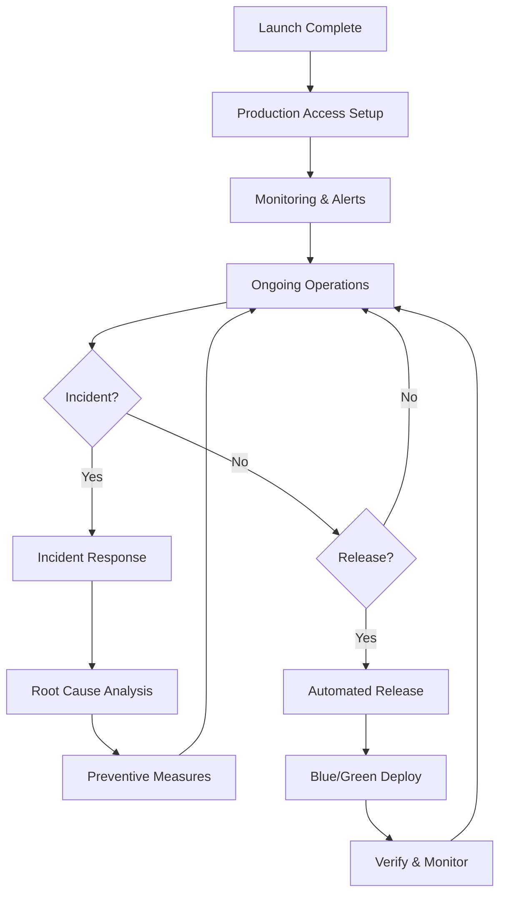
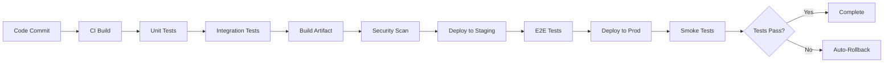
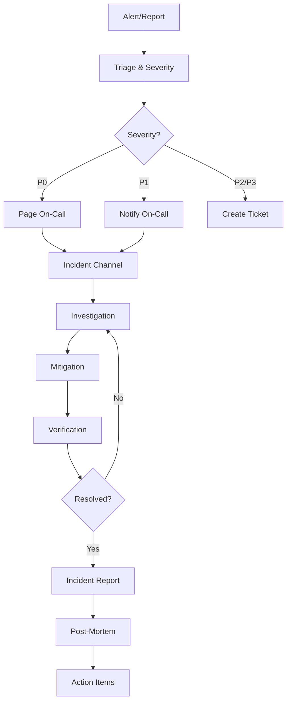
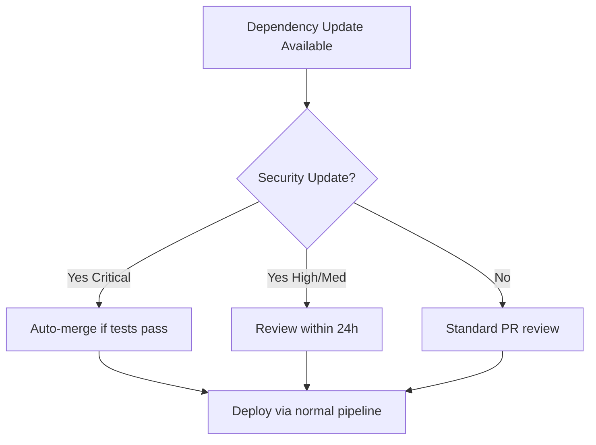

# SOP-12.02: Post-Launch Operations & Support

## Purpose

This SOP defines post-launch production operations, including access control, release automation, deployment strategies, monitoring, and support workflows.

## Scope

- Production access control (least privilege)
- Automated release pipelines
- Binary promotion and artifact provenance
- Blue/green deployment strategies
- Monitoring and observability
- Incident response
- Support ticketing and escalation
- **Dependency maintenance and security updates**

---

## Process Overview



---

## Phase 1: Production Access Control

### 1.1 Least Privilege Access

**Principle**: Grant minimum necessary access for role

**Access Tiers**:

1. **Read-Only** (Monitoring, support)
2. **Deployment** (Automated CI/CD only)
3. **Configuration** (DevOps, on-call engineers)
4. **Administrative** (Platform team leads, emergency only)

**Access Matrix**:

| Role      | Logs | Metrics | Deploy | Config | Database  | Secrets   |
| --------- | ---- | ------- | ------ | ------ | --------- | --------- |
| Support   | ✅   | ✅      | ❌     | ❌     | ❌        | ❌        |
| Developer | ✅   | ✅      | ❌     | ❌     | ❌        | ❌        |
| DevOps    | ✅   | ✅      | ✅     | ✅     | Read-only | Read-only |
| On-Call   | ✅   | ✅      | ✅     | ✅     | ✅        | Read-only |
| Admin     | ✅   | ✅      | ✅     | ✅     | ✅        | ✅        |

### 1.2 Access Request Workflow

**Process**:

1. **Request**: Submit ticket with justification and duration
2. **Approval**: Manager + Security Lead approval
3. **Grant**: Time-limited access (default: 8 hours)
4. **Audit**: All production access logged
5. **Revoke**: Auto-revoke after time limit

**Break-Glass Access**:

- Emergency admin access available
- Requires two-person approval (async if P0 incident)
- Audit trail mandatory
- Post-incident review required

---

## Phase 2: Automated Release Pipeline

### 2.1 Fully Automated Production Releases

**Goal**: Zero-touch production deployments

**Pipeline Stages**:



**Deployment Triggers**:

- **Automatic**: On merge to `main` branch (after all checks pass)
- **Scheduled**: Off-peak hours (e.g., 2 AM UTC)
- **Manual**: Emergency hotfixes only

### 2.2 Binary Promotion (No Rebuilds)

**Principle**: Same artifact from dev → staging → production

**Artifact Provenance**:

```yaml
artifact_metadata:
  build_id: '20251122-1445-a3f2c1'
  commit_sha: 'a3f2c1d8e9b4...'
  branch: 'main'
  build_timestamp: '2025-11-22T14:45:00Z'
  tests_passed:
    - unit_tests: ✅
    - integration_tests: ✅
    - security_scan: ✅
    - e2e_tests: ✅
  deployed_to:
    - staging: '2025-11-22T15:00:00Z'
    - production: '2025-11-22T18:00:00Z'
```

**Benefits**:

- Deterministic deployments
- Faster releases (no rebuild time)
- Compliance (same tested artifact)
- Audit trail

---

## Phase 3: Blue/Green Deployment

### 3.1 Zero-Downtime Deployment Strategy

**Setup**:

- **Blue Environment**: Current production
- **Green Environment**: New version (standby)

**Process**:

1. **Deploy to Green**
   - Deploy new version to green environment
   - Green environment receives no traffic

2. **Smoke Test Green**

   ```bash
   # Automated smoke tests against green
   curl -f https://green.example.com/health
   curl -f https://green.example.com/api/version
   # Run critical path tests
   ```

3. **Traffic Shift** (gradual canary)

   ```
   Blue: 100% → 90% → 50% → 10% → 0%
   Green: 0% → 10% → 50% → 90% → 100%

   Duration: 30 minutes (5% every 3 minutes)
   ```

4. **Monitor Metrics**
   - Error rate
   - Response time
   - Success rate
   - Business metrics

5. **Rollback Decision**

   ```
   IF error_rate > threshold OR response_time > threshold THEN
     Instant rollback to blue
   ELSE
     Continue canary deployment
   ```

6. **Complete or Rollback**
   - **Success**: Green becomes new blue
   - **Failure**: Instant traffic shift back to blue

### 3.2 Automated Rollback

**Triggers**:

- Error rate spike (> 1% increase)
- Response time degradation (> 20% increase)
- Failed health checks
- Manual trigger by on-call

**Rollback Process**:

```
Trigger → Shift traffic to blue (< 5 seconds)
       → Alert on-call engineer
       → Preserve green for debugging
       → Create incident ticket
       → Root cause analysis required
```

---

## Phase 4: Monitoring & Observability

### 4.1 Monitoring Stack

**Components**:

1. **Metrics** (Prometheus, Datadog, CloudWatch)
   - Request rate
   - Error rate
   - Response time
   - Resource utilization

2. **Logs** (ELK, Splunk, CloudWatch Logs)
   - Application logs
   - Access logs
   - Error logs
   - Audit logs

3. **Traces** (Jaeger, X-Ray, Datadog APM)
   - Request flow
   - Performance bottlenecks
   - Service dependencies

4. **Alerts** (PagerDuty, Opsgenie)
   - Critical alerts → Page on-call
   - Warning alerts → Ticket creation
   - Info alerts → Dashboard only

### 4.2 Key Metrics Dashboard

**Golden Signals**:

1. **Latency**: How long requests take
2. **Traffic**: How many requests
3. **Errors**: How many requests fail
4. **Saturation**: How full the system is

**Business Metrics**:

- User registrations per hour
- API calls per minute
- Revenue-generating events
- Customer-impacting errors

### 4.3 Alert Configuration

**P0 (Critical) - Page Immediately**:

- Service down (health check fails)
- Error rate > 5%
- Response time > 5 seconds
- Data integrity issue

**P1 (High) - Page within 15 min**:

- Error rate > 2%
- Response time > 2 seconds
- Capacity at 80%

**P2 (Medium) - Create ticket**:

- Error rate > 1%
- Response time > 1 second
- Capacity at 70%

**P3 (Low) - Dashboard**:

- Minor performance degradation
- Non-critical service issues

---

## Phase 5: Incident Response

### 5.1 Incident Management Process

**Incident Roles**:

- **Incident Commander**: Coordinates response
- **Technical Lead**: Directs technical investigation
- **Communications Lead**: Updates stakeholders
- **Scribe**: Documents timeline and decisions

**Incident Workflow**:



### 5.2 Incident Communication

**Internal Updates**:

- Slack incident channel
- Every 30 minutes (P0)
- Every hour (P1)

**External Updates** (if customer-facing):

- Status page update
- Email to affected customers (if applicable)
- Post-incident summary

### 5.3 Post-Mortem

**Within 48 hours of P0/P1 incidents**:

**Format**:

```markdown
# Incident Post-Mortem: [Title]

## Summary

[One-paragraph summary]

## Timeline

- HH:MM - Alert triggered
- HH:MM - On-call paged
- HH:MM - Investigation started
- HH:MM - Root cause identified
- HH:MM - Mitigation deployed
- HH:MM - Incident resolved

## Root Cause

[What actually caused the issue]

## Impact

- Duration: X hours
- Users affected: X
- Requests failed: X
- Revenue impact: $X

## What Went Well

- [Positive aspect]

## What Went Wrong

- [Negative aspect]

## Action Items

- [ ] Preventive measure 1 (Owner: X, Due: DATE)
- [ ] Preventive measure 2 (Owner: Y, Due: DATE)
- [ ] Documentation update (Owner: Z, Due: DATE)

## Lessons Learned

[Key takeaways]
```

**Blameless Culture**: Focus on systems, not individuals

---

## Phase 6: Support Operations

### 6.1 Support Ticketing System

**Ticket Categories**:

1. **Bug Report**
2. **Feature Request**
3. **Question/How-To**
4. **Account Issue**
5. **Performance Issue**

**Ticket Priority**:

- **Critical**: System down for customer
- **High**: Major feature broken
- **Medium**: Minor feature issue
- **Low**: Enhancement request

**SLA by Priority**:
| Priority | First Response | Resolution |
|----------|---------------|------------|
| Critical | 1 hour | 4 hours |
| High | 4 hours | 24 hours |
| Medium | 12 hours | 3 days |
| Low | 24 hours | 7 days |

### 6.2 Escalation Path

```
Tier 1 Support (Customer Success)
    ↓ (if technical)
Tier 2 Support (Engineering)
    ↓ (if critical)
On-Call Engineer
    ↓ (if P0)
Incident Commander + Engineering Lead
```

### 6.3 Support Knowledge Base

**Contents**:

- Common issues & solutions
- How-to guides
- Troubleshooting flows
- API documentation
- Video tutorials

**Maintenance**:

- Update after each post-mortem
- Add solutions from support tickets
- Review quarterly for accuracy

---

## Tools & Automation

### CLI Commands

```bash
# Check production status
sc ops status

# View recent deployments
sc ops deployments --limit=10

# Trigger rollback
sc ops rollback --deployment=abc123

# Check alerts
sc ops alerts --severity=critical

# Create incident
sc ops incident --severity=P0 --title="Service Down"

# Generate incident report
sc ops incident-report --id=INC-123
```

### Automation Scripts

**Health Check**:

```bash
#!/bin/bash
# Automated health check (runs every 5 minutes)
sc ops health-check --full
```

**Deployment Verification**:

```bash
#!/bin/bash
# Post-deployment smoke tests
sc ops verify-deployment --env=production
```

---

## Runbooks

### Location

`docs/operations/runbooks/`

### Common Runbooks

1. **Service Down**: Restart procedures
2. **Database Issues**: Connection pool, query optimization
3. **High Error Rate**: Log analysis, rollback decision
4. **Performance Degradation**: Scaling, optimization
5. **Security Incident**: Containment, forensics

**Runbook Template**:

```markdown
# Runbook: [Issue Name]

## Symptoms

- [Observable symptom 1]
- [Observable symptom 2]

## Triage

1. Check [metric/log]
2. Verify [component]

## Resolution Steps

1. [Step 1]
2. [Step 2]
3. [Verify resolution]

## Escalation

If steps don't work, escalate to [role/person]

## Prevention

- [Preventive measure]
```

---

## Roles & Responsibilities

| Role                                | Responsibilities                              |
| ----------------------------------- | --------------------------------------------- |
| **DevOps Engineer**                 | Pipeline maintenance, deployments, monitoring |
| **On-Call Engineer**                | Incident response, system stability           |
| **Site Reliability Engineer (SRE)** | Reliability improvements, automation          |
| **Support Engineer**                | Customer issues, ticket resolution            |
| **Platform Lead**                   | Strategy, architecture, escalations           |

### On-Call Rotation

**Schedule**:

- Primary on-call: 1 week rotation
- Secondary on-call: Backup
- Timezone coverage: Follow-the-sun or 24/7

**On-Call Expectations**:

- Respond to pages within 15 minutes
- Available for duration of incident
- Complete post-mortem within 48 hours
- Compensated (time off or pay)

---

## Success Metrics

**Reliability**:

- **Uptime**: Target 99.9% (< 43 minutes downtime/month)
- **MTTR**: Mean time to recovery (target < 1 hour for P0)
- **MTTD**: Mean time to detect (target < 5 minutes)

**Deployments**:

- **Frequency**: Daily deployments
- **Success Rate**: > 95%
- **Rollback Rate**: < 5%
- **Lead Time**: Commit to production < 4 hours

**Support**:

- **First Response Time**: Meet SLA 95% of time
- **Customer Satisfaction**: CSAT > 4.5/5
- **Ticket Resolution**: Within SLA 90% of time

---

## Phase 7: Dependency Maintenance

### 7.1 Automated Dependency Updates

**Tools** (configured via `sc init --security`):

| Tool | Purpose | Automation Level |
|------|---------|------------------|
| GitHub Dependabot | Automated PRs for updates | High - auto PR creation |
| Snyk | Vulnerability scanning + fixes | High - auto PR creation |
| Socket.dev | Supply chain protection | Medium - alerts only |
| npm audit | Built-in vulnerability check | Low - manual |

See [Coding Standards - Dependency Security](../../architecture/patterns/coding-standards.md#dependency-security--updates) for tool configuration.

### 7.2 Maintenance Schedule

| Activity | Frequency | Owner |
|----------|-----------|-------|
| Review Dependabot PRs | Daily | On-call dev |
| Snyk vulnerability review | Daily | Security champion |
| License compliance audit | Monthly | DevOps |
| Major version upgrades | Quarterly | Tech lead |

### 7.3 Update Workflow



**Supernal Coding Integration**:

```bash
# Check dependency status across projects
sc security status --all-projects

# Review pending security updates
sc security updates --pending

# Generate compliance report
sc security report --format=pdf
```

> **See Also**: [REQ-096: Automated Package Compliance Bot](../../requirements/workflow/req-096-automated-package-compliance-bot.md)

---

## Related Documents

- **SOP-12.01**: [Marketing & Launch](SOP-12.01-marketing-launch.md)
- **SOP-3.04**: [Security Analysis](../phase-3-design/SOP-3.04-security-analysis.md)
- **Part 13**: [Change Control & Deployment](../general/SOP-0.1.13-change-control.md)
- **Part 14**: [Evaluation & Learning](../general/SOP-0.1.14-evaluation-learning.md)

---

**Status**: Active  
**Last Updated**: 2024-11-22  
**Owner**: DevOps Lead  
**Review Cycle**: Quarterly or after major incidents
