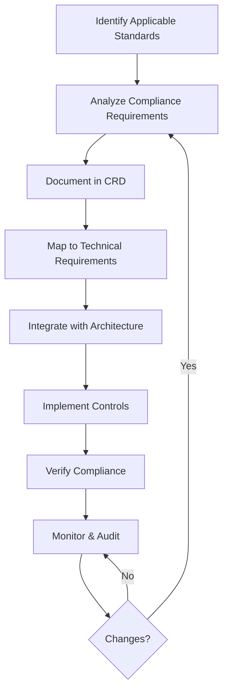

# SOP-3.03: Compliance Requirements Management

## Purpose

This SOP defines how to identify, document, track, and verify compliance requirements for software projects. Applicable to HIPAA, GDPR, FDA 21 CFR Part 11, ISO 13485, SOC2, and other regulatory frameworks.

## Scope

- Compliance requirement identification
- Compliance Requirements Document (CRD) creation
- Integration with technical requirements and architecture
- Verification and ongoing monitoring
- Audit trail maintenance

---

## Process Overview



---

## Phase 1: Compliance Framework Identification

### 1.1 Determine Applicable Standards

**Human Role**: Compliance Officer, Legal Team, Product Owner

**Process**:

1. Identify applicable regulatory frameworks based on:
   - Industry (healthcare, finance, etc.)
   - Geographic regions (US, EU, etc.)
   - Data types processed (PII, PHI, financial)
   - Customer requirements
2. Document applicable standards:
   - HIPAA (US healthcare)
   - GDPR (EU data privacy)
   - FDA 21 CFR Part 11 (medical devices, electronic records)
   - ISO 13485 (medical device quality management)
   - SOC2 (security, availability, processing integrity)
   - PCI DSS (payment card industry)
   - Others as applicable

**Output**: List of applicable compliance frameworks

---

## Phase 2: Compliance Requirements Analysis

### 2.1 Extract Requirements from Standards

**Human Role**: Compliance Officer with AI Assistance

**AI Assistance**:

- Parse compliance documents
- Extract specific requirements
- Categorize by control type
- Suggest implementation approaches

**Process**:

1. For each applicable standard:
   - Review official documentation
   - Extract specific requirements
   - Classify by category (access control, audit trails, data protection, etc.)
   - Assign unique compliance IDs

2. Create requirement entries:
   ```yaml
   ---
   compliance_id: COMP-HIPAA-001
   standard: HIPAA
   section: '§164.312(a)(1)'
   category: access_control
   requirement_text: 'Standard: Access control. Implement technical policies...'
   status: identified
   ---
   ```

**Output**: Structured list of compliance requirements per standard

---

## Phase 3: Compliance Requirements Document (CRD)

### 3.1 CRD Structure

**Location**: `docs/requirements/compliance/{framework}/`

**Format**:

```markdown
---
framework: HIPAA
standard_version: '45 CFR Parts 160, 162, and 164'
document_type: compliance_requirements
created: YYYY-MM-DD
updated: YYYY-MM-DD
status: current
---

# HIPAA Compliance Requirements

## Overview

[Framework overview and applicability]

## Requirements

### Access Control (§164.312(a))

#### COMP-HIPAA-001: Unique User Identification

**Standard**: §164.312(a)(2)(i)
**Requirement**: Assign a unique name and/or number for identifying and tracking user identity

**Technical Controls**:

- Unique user IDs for all system access
- No shared credentials
- User activity audit logging

**Implementation**: [REQ-XXX: User Authentication](../core/req-xxx-user-auth.md)
**Architecture**: [SAD-2: System Overview](../../architecture/system/02-system-overview.md)
**Verification**: Automated audit log review, quarterly access review

---

### Audit Controls (§164.312(b))

#### COMP-HIPAA-002: Audit Trail

[...]
```

### 3.2 Mapping to Technical Requirements

**Process**:

1. For each compliance requirement:
   - Identify related technical requirements
   - Create cross-references in frontmatter
   - Document control implementation approach

2. Update technical requirements with compliance tags:
   ```yaml
   ---
   req_id: REQ-042
   compliance_refs:
     - framework: HIPAA
       req_id: COMP-HIPAA-001
       section: '§164.312(a)(2)(i)'
     - framework: GDPR
       req_id: COMP-GDPR-005
       article: 'Article 32'
   ---
   ```

---

## Phase 4: Architecture Integration

### 4.1 Compliance Architecture Review

**Human Role**: Architect, Compliance Officer

**Process**:

1. Review architecture documents for compliance impact
2. Ensure architecture addresses compliance requirements
3. Document compliance design decisions in ADRs

**Example ADR**:

```markdown
# ADR-012: HIPAA Audit Logging Implementation

## Context

HIPAA requires comprehensive audit trails (§164.312(b))

## Decision

Implement centralized audit logging using CloudWatch with 7-year retention

## Compliance Mapping

- COMP-HIPAA-002: Audit Trail
- COMP-HIPAA-003: Log Protection
```

---

## Phase 5: Implementation

### 5.1 Control Implementation

**Human Role**: Developers with AI Assistance

**AI Assistance**:

- Generate boilerplate compliance code
- Suggest testing approaches
- Review for compliance gaps

**Process**:

1. Implement technical controls per requirements
2. Tag implementation with compliance IDs:

   ```javascript
   /**
    * User authentication implementation
    * @compliance COMP-HIPAA-001 Unique User Identification
    * @compliance COMP-GDPR-005 Access Control
    */
   async function authenticateUser(credentials) {
     // Implementation
   }
   ```

3. Create compliance test cases:
   ```javascript
   describe('HIPAA Compliance - Access Control', () => {
     it('COMP-HIPAA-001: should enforce unique user IDs', async () => {
       // Test
     });
   });
   ```

---

## Phase 6: Verification

### 6.1 Compliance Verification Process

**Human Role**: QA Team, Compliance Officer

**Verification Methods**:

1. **Automated Testing**
   - Unit tests for compliance controls
   - Integration tests for workflows
   - Penetration testing

2. **Manual Review**
   - Code review with compliance checklist
   - Architecture review
   - Documentation review

3. **Third-Party Assessment**
   - External audits
   - Certification processes
   - Penetration testing

**Documentation**:

```markdown
# Compliance Verification Log

## COMP-HIPAA-001: Unique User Identification

- **Implementation**: REQ-042 User Authentication
- **Test Coverage**: 95%
- **Last Verified**: 2025-11-22
- **Verification Method**: Automated testing + manual review
- **Status**: ✅ Compliant
- **Evidence**: `tests/compliance/hipaa-access-control.test.js`
```

---

## Phase 7: Ongoing Monitoring

### 7.1 Continuous Compliance Monitoring

**Process**:

1. **Automated Monitoring**
   - Run compliance test suites in CI/CD
   - Monitor audit logs for violations
   - Alert on compliance anomalies

2. **Periodic Reviews**
   - Monthly: Review new requirements
   - Quarterly: Compliance dashboard review
   - Annually: Full compliance audit

3. **Change Management**
   - Assess compliance impact of changes
   - Update CRD when standards change
   - Re-verify affected controls

---

## Traceability Matrix

### Compliance → Requirements → Architecture → Implementation

**Structure**:

```
COMP-HIPAA-001 (Unique User IDs)
    ↓
REQ-042 (User Authentication System)
    ↓
SAD-2 (Authentication Architecture)
    ↓
ADR-015 (JWT Token Decision)
    ↓
Implementation: src/auth/user-auth.js
    ↓
Tests: tests/compliance/hipaa/access-control.test.js
```

**Command**: `sc traceability compliance COMP-HIPAA-001`

---

## Tools & Automation

### CLI Commands

```bash
# Create new compliance requirement
sc requirement new "Unique user identification" \
  --type=compliance \
  --framework=HIPAA \
  --section="164.312(a)(2)(i)"

# Validate compliance requirements
sc validate --compliance

# Generate compliance report
sc compliance report --framework=HIPAA

# Check requirement coverage
sc compliance coverage --framework=GDPR
```

---

## Compliance Requirements Template

**Location**: `templates/compliance/{framework}/requirement-template.md`

**Usage**: Copy and customize for specific framework

---

## Roles & Responsibilities

| Role                   | Responsibilities                                    |
| ---------------------- | --------------------------------------------------- |
| **Compliance Officer** | Identify standards, maintain CRD, verify compliance |
| **Legal Team**         | Interpret requirements, review documentation        |
| **Product Owner**      | Prioritize compliance work, approve trade-offs      |
| **Architect**          | Design compliant architecture, create ADRs          |
| **Developers**         | Implement controls, tag code with compliance IDs    |
| **QA Team**            | Verify controls, maintain test coverage             |
| **Security Team**      | Security reviews, penetration testing               |

---

## Success Metrics

- **Coverage**: % of compliance requirements with technical implementation
- **Verification**: % of requirements with passing tests
- **Traceability**: % of requirements with complete trace (CRD → Implementation → Tests)
- **Audit Readiness**: Time to generate compliance report
- **Change Response**: Time to assess compliance impact of changes

---

## Expected Documentation

> **📚 Complete Reference**: See [SOP-0.1.17: Documentation Requirements](../general/SOP-0.1.17-documentation-requirements.md) for all phases

### Architecture/Planning (Broad-scale)

**REQUIRED** (Compliance):

- **Compliance Documentation**: `docs/architecture/decisions/compliance/` - Compliance-related ADRs (See ADR template in supernal-code-package)
- **Compliance Matrix**: `docs/planning/compliance/traceability-matrix.md` - Requirement traceability (See traceability matrix template in supernal-code-package)

**SUGGESTED**:

- **Framework-Specific Docs**: `docs/planning/compliance/{framework}/` - HIPAA, GDPR, SOC2, etc. specific documentation

### Feature-Specific

**SUGGESTED**:

- **Feature Folder**: `docs/features/\{domain\}/{feature-name}/compliance.md` (phase: drafting) - Feature-specific compliance requirements

---

## Related Documents

- **SOP-3.04**: [Security Analysis](SOP-3.04-security-analysis.md)
- **Part 05**: [Requirements & Planning](../general/SOP-0.1.05-requirements-planning.md)
- **Part 06**: [Design & Architecture](../general/SOP-0.1.06-design-architecture.md)

---

## Expected Documentation

### Architecture/Planning

- **Compliance Documentation**: `docs/architecture/decisions/compliance/` - Compliance-related ADRs
- **Compliance Matrix**: `docs/planning/compliance/traceability-matrix.md`

### Feature-Specific

- **Feature Folder**: `docs/features/\{domain\}/{feature-name}/compliance.md` (phase: drafting) - Feature-specific compliance requirements

---

**Status**: Active  
**Last Updated**: 2024-11-22  
**Owner**: Compliance Officer  
**Review Cycle**: Quarterly
