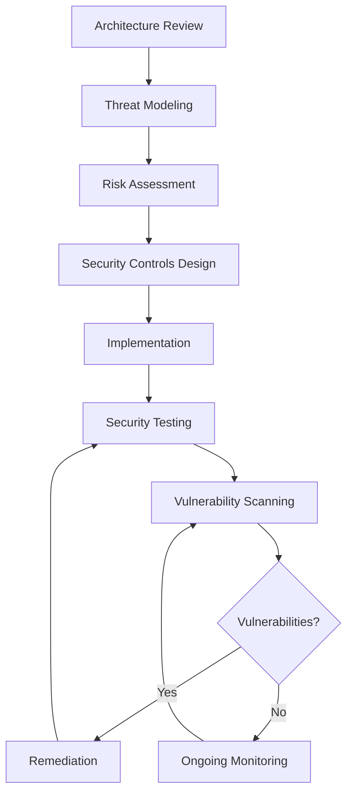
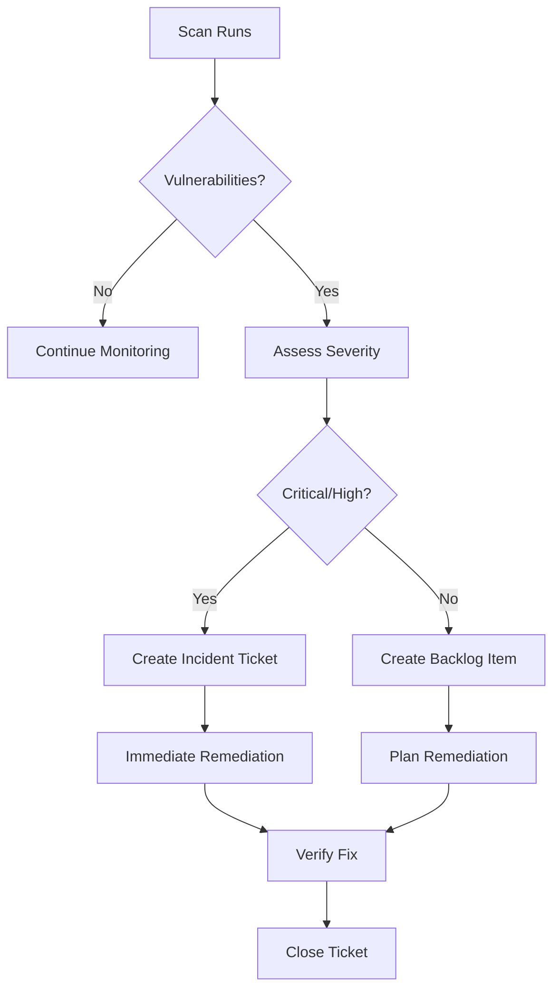

# SOP-3.04: Security Analysis & Threat Modeling

## Purpose

This SOP defines the security analysis process for software projects, including threat modeling, risk assessment, security controls specification, and vulnerability management.

## Scope

- Threat identification and modeling
- Risk assessment and prioritization
- Security controls design
- Vulnerability scanning and remediation
- Security documentation

---

## Process Overview



---

## Phase 1: Architecture Security Review

### 1.1 Security Architecture Assessment

**Human Role**: Security Lead, Architect

**AI Assistance**:

- Identify common security patterns
- Suggest security best practices
- Flag potential vulnerabilities

**Process**:

1. Review system architecture documents (SAD)
2. Identify security-sensitive components:
   - Authentication & authorization
   - Data storage (PII, credentials, secrets)
   - External integrations
   - API endpoints
   - Admin interfaces

3. Document security boundaries:
   - Trust boundaries
   - Network segments
   - Data classification zones

**Output**: Security architecture overview with identified sensitive areas

---

## Phase 2: Threat Modeling

### 2.1 STRIDE Threat Model

**Framework**: STRIDE (Spoofing, Tampering, Repudiation, Information Disclosure, Denial of Service, Elevation of Privilege)

**Process**:

1. **Identify Assets**
   - User data (PII, credentials)
   - Business logic
   - System availability
   - Intellectual property

2. **Create Data Flow Diagrams**

   ```
   [User] --HTTPS--> [Load Balancer] ---> [API Server]
                                              |
                                              v
                                         [Database]
   ```

3. **Apply STRIDE per Component**

   **Example: API Server**
   - **Spoofing**: Could attacker impersonate legitimate user?
   - **Tampering**: Could attacker modify data in transit/at rest?
   - **Repudiation**: Can actions be traced to users?
   - **Information Disclosure**: Could sensitive data leak?
   - **Denial of Service**: Could attacker overwhelm system?
   - **Elevation of Privilege**: Could attacker gain admin access?

4. **Document Threats**
   ```yaml
   ---
   threat_id: THREAT-001
   component: API Authentication
   category: Spoofing
   description: 'Attacker could steal JWT tokens via XSS'
   likelihood: Medium
   impact: High
   risk_score: High
   ---
   ```

**Output**: Comprehensive threat model document

---

## Phase 3: Risk Assessment

### 3.1 Risk Scoring Matrix

**Formula**: Risk = Likelihood × Impact

| Likelihood      | Impact          | Risk Level |
| --------------- | --------------- | ---------- |
| Low × Low       | = Low Risk      |            |
| Low × Medium    | = Low Risk      |            |
| Low × High      | = Medium Risk   |            |
| Medium × Low    | = Low Risk      |            |
| Medium × Medium | = Medium Risk   | ⚠️         |
| Medium × High   | = High Risk     | 🚨         |
| High × Low      | = Medium Risk   | ⚠️         |
| High × Medium   | = High Risk     | 🚨         |
| High × High     | = Critical Risk | 🔴         |

### 3.2 Risk Assessment Process

**For Each Threat**:

1. **Assess Likelihood**
   - Low: Requires significant expertise/resources
   - Medium: Moderately difficult to exploit
   - High: Easy to exploit with common tools

2. **Assess Impact**
   - Low: Minimal business/user impact
   - Medium: Moderate data loss or service disruption
   - High: Significant data breach or system compromise

3. **Calculate Risk Score**

4. **Prioritize Mitigation**
   - Critical/High: Immediate mitigation required
   - Medium: Plan mitigation in next sprint
   - Low: Monitor, mitigate when resources available

**Example**:

```markdown
## THREAT-001: JWT Token Theft via XSS

**Likelihood**: Medium (requires XSS vulnerability)
**Impact**: High (account takeover, data access)
**Risk Score**: 🚨 High

**Mitigation Strategy**:

- Use HttpOnly cookies instead of localStorage
- Implement CSP headers
- Sanitize all user inputs
```

---

## Phase 4: Security Controls Design

### 4.1 Control Selection

**For Each High/Critical Risk**:

1. **Design Security Controls**
   - Preventive (stop attack)
   - Detective (detect attack in progress)
   - Corrective (respond to attack)

2. **Document Control Requirements**

   ```yaml
   ---
   control_id: CTRL-001
   threat_id: THREAT-001
   control_type: Preventive
   requirement: 'Store JWT tokens in HttpOnly cookies'
   implementation_req: REQ-SEC-001
   ---
   ```

3. **Map to Requirements**
   - Create security requirements (REQ-SEC-\*)
   - Link to architecture (SAD, ADR)
   - Define acceptance criteria

---

## Phase 5: Security Analysis Document (SeAD)

### 5.1 Document Structure

**Location**: `docs/security/security-analysis.md`

**Format**:

```markdown
---
document_type: security_analysis
created: YYYY-MM-DD
updated: YYYY-MM-DD
status: current
threat_model_version: '1.2'
---

# Security Analysis Document

## 1. Security Overview

[System security posture]

## 2. Assets & Data Classification

| Asset    | Classification | Location        | Protection         |
| -------- | -------------- | --------------- | ------------------ |
| User PII | Confidential   | Database        | Encrypted at rest  |
| API Keys | Secret         | Secrets Manager | Encrypted, rotated |

## 3. Threat Model

[STRIDE analysis results]

## 4. Risk Assessment

[Risk matrix and prioritized threats]

## 5. Security Controls

| Control ID | Threat     | Description      | Status         |
| ---------- | ---------- | ---------------- | -------------- |
| CTRL-001   | THREAT-001 | HttpOnly cookies | ✅ Implemented |

## 6. Verification

[How controls are tested]

## 7. Monitoring

[How threats are monitored]
```

---

## Phase 6: Implementation & Verification

### 6.1 Security Requirements Implementation

**Process**:

1. Implement security controls per requirements
2. Tag code with security control IDs:

   ```javascript
   /**
    * @security CTRL-001 JWT stored in HttpOnly cookies
    * @mitigates THREAT-001 XSS token theft
    */
   function setAuthToken(token) {
     res.cookie('token', token, {
       httpOnly: true,
       secure: true,
       sameSite: 'strict',
     });
   }
   ```

3. Create security test cases:

   ```javascript
   describe('Security Controls', () => {
     it('CTRL-001: should use HttpOnly cookies', async () => {
       const res = await login();
       expect(res.headers['set-cookie']).toContain('HttpOnly');
     });

     it('THREAT-001: should prevent XSS token theft', async () => {
       // Attempt XSS attack
       // Verify token not accessible via document.cookie
     });
   });
   ```

---

## Phase 7: Vulnerability Scanning

### 7.1 Continuous Vulnerability Scanning

**Ongoing Process** (runs automatically)

**Scan Types**:

1. **Static Application Security Testing (SAST)**
   - Code analysis for vulnerabilities
   - Runs on every commit
   - Tools: SonarQube, Snyk, GitHub CodeQL

2. **Software Composition Analysis (SCA)**
   - Dependency vulnerability scanning
   - Supply chain attack detection
   - License compliance checking
   - Runs daily
   - Tools: npm audit, Snyk, Dependabot, Socket.dev
   - See [Coding Standards - Dependency Security](../../../architecture/patterns/coding-standards.md#dependency-security--updates)

3. **Dynamic Application Security Testing (DAST)**
   - Runtime vulnerability scanning
   - Runs on staging deployments
   - Tools: OWASP ZAP, Burp Suite

4. **Penetration Testing**
   - Manual security testing
   - Quarterly or before major releases
   - External security firm

**Process**:



---

## Phase 8: Incident Response

### 8.1 Security Incident Workflow

**When Vulnerability Discovered**:

1. **Triage** (within 1 hour)
   - Assess severity
   - Determine exploitation status
   - Notify stakeholders

2. **Containment** (Critical: immediate, High: 24h)
   - Disable vulnerable feature if needed
   - Block attack vectors
   - Preserve evidence

3. **Remediation** (per SLA)
   - Develop fix
   - Test thoroughly
   - Deploy to production

4. **Recovery**
   - Verify fix effectiveness
   - Restore services
   - Monitor for reoccurrence

5. **Post-Mortem**
   - Document incident
   - Update threat model
   - Improve detection

**SLAs by Severity**:

- **Critical**: Fix within 24 hours
- **High**: Fix within 7 days
- **Medium**: Fix within 30 days
- **Low**: Fix when resources available

---

## Security Testing Strategy

### Test Types

1. **Unit Tests** (security controls)

   ```javascript
   describe('Authentication Security', () => {
     it('should hash passwords with bcrypt', async () => {
       // Test password hashing
     });
   });
   ```

2. **Integration Tests** (security workflows)

   ```javascript
   describe('RBAC Authorization', () => {
     it('should deny access without permission', async () => {
       // Test access control
     });
   });
   ```

3. **Security Tests** (threat-based)

   ```javascript
   describe('THREAT-001: XSS Token Theft', () => {
     it('should prevent script injection', async () => {
       // Test XSS protection
     });
   });
   ```

4. **Penetration Tests** (realistic attacks)
   - Performed by security team/external firm
   - Documented in security test reports

---

## Tools & Automation

### CLI Commands

```bash
# Run security analysis
sc security analyze

# Generate threat model
sc security threat-model --output docs/security/

# Run vulnerability scan
sc security scan --type=sast

# Check for high-severity vulnerabilities
sc security vulnerabilities --severity=high

# Generate security report
sc security report
```

### Automated Scanning

**Supernal Coding Auto-Configuration**:

Supernal Coding can automatically configure security scanning tools during project initialization:

```bash
# Auto-detect project type and configure security tools
sc init --security

# Configure specific tools
sc security setup --tools=dependabot,snyk

# Check security tool status
sc security status
```

**GitHub Actions**:

```yaml
- name: Security Scan
  run: |
    npm audit --audit-level=high
    npx snyk test
    sc security scan --type=sast
```

> **Note**: See [REQ-096: Automated Package Compliance Bot](../../../requirements/workflow/req-096-automated-package-compliance-bot.md) for planned automated dependency management.

---

## Security Analysis Document Template

**Location**: `templates/security/security-analysis-template.md`

**Usage**: Copy and customize for project

---

## Roles & Responsibilities

| Role              | Responsibilities                                        |
| ----------------- | ------------------------------------------------------- |
| **Security Lead** | Threat modeling, risk assessment, security architecture |
| **Architect**     | Security architecture integration, ADR creation         |
| **Developers**    | Implement security controls, fix vulnerabilities        |
| **QA Team**       | Security testing, verify controls                       |
| **DevOps Team**   | Vulnerability scanning, monitoring, incident response   |
| **Management**    | Approve risk acceptance, resource allocation            |

---

## Success Metrics

- **Vulnerability Detection**: Mean time to detect (MTTD)
- **Remediation Speed**: Mean time to remediate (MTTR) by severity
- **Coverage**: % of threats with implemented controls
- **Testing**: % of security controls with automated tests
- **Scanning**: Frequency of vulnerability scans
- **Incidents**: Number of security incidents per month

---

## Related Documents

- **SOP-3.03**: [Compliance Requirements](SOP-3.03-compliance-requirements.md)
- **Part 06**: [Design & Architecture] (see project documentation)
- **Part 08**: [Testing Strategy] (see project documentation)

---

## Expected Documentation

> **📚 Complete Reference**: See [SOP-0.1.17: Documentation Requirements] (see project documentation) for all phases

### Architecture/Planning (Broad-scale)

**REQUIRED** (Compliance):

- **Security Documentation**: `docs/architecture/decisions/security/` - Security-related ADRs ([ADR template] (see project documentation))
- **Threat Model**: `docs/planning/security/threat-model.md` - STRIDE analysis ([template] (see project documentation))
- **Risk Assessment**: `docs/planning/security/risk-assessment.md` - Quarterly risk evaluation ([template] (see project documentation))

**SUGGESTED**:

- **Security Policy**: `docs/security/security-policy.md` - Organization-wide security policies
- **Incident Response Plan**: `docs/security/incident-response.md` - Breach response procedures

### Feature-Specific

**SUGGESTED**:

- **Feature Folder**: `docs/features/\{domain\}/{feature-name}/security.md` (phase: drafting) - Feature-specific security analysis

---

**Status**: Active  
**Last Updated**: 2024-11-22  
**Owner**: Security Lead  
**Review Cycle**: Quarterly or after security incidents
