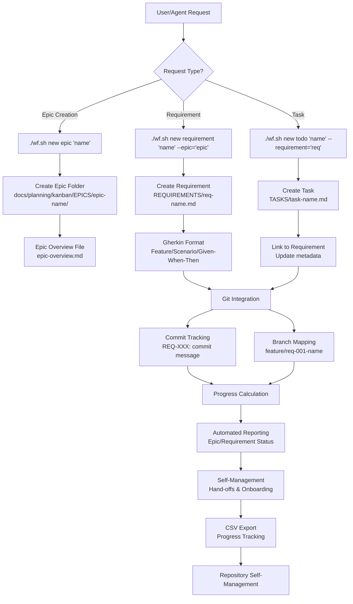
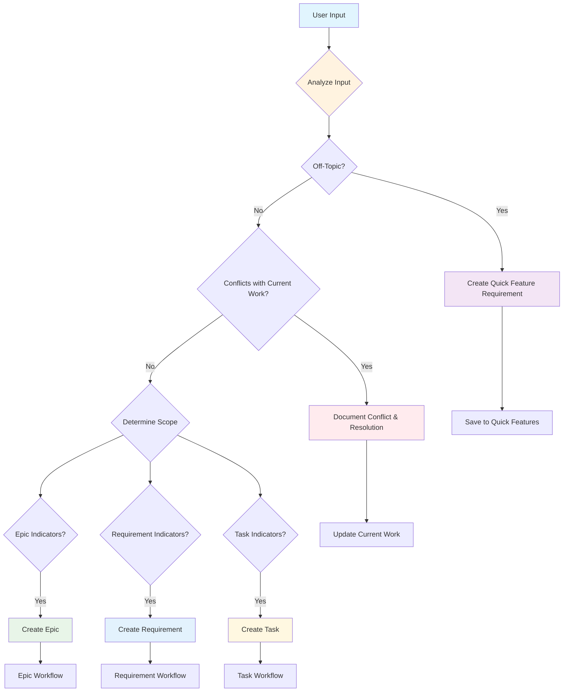

# System Architecture

## 🏗️ **Complete System Architecture**

The following diagram illustrates the complete workflow from user requests through epic/requirement/task creation to automated reporting and self-management:



## 🔄 **Main Workflow Decision Tree**



## 🎯 **Scope Classification**

### **Epic Indicators**

- Multiple related features or major system changes
- Cross-cutting concerns affecting multiple components
- Long-term initiatives spanning multiple sprints
- Infrastructure or architectural changes

**Examples:**

- "Implement complete user authentication system"
- "Add real-time collaboration features"
- "Migrate to microservices architecture"

### **Requirement Indicators**

- Specific functional capabilities
- Well-defined acceptance criteria
- Single area of functionality
- Can be implemented in 1-2 sprints

**Examples:**

- "User login with email and password"
- "Export data to CSV format"
- "Add dark mode toggle"

### **Task Indicators**

- Specific implementation work
- Bug fixes or small improvements
- Part of a larger requirement
- Can be completed in hours or days

**Examples:**

- "Fix login button styling"
- "Add unit tests for auth service"
- "Update documentation for new API endpoint"

## 🔄 **Flow Control Logic**

### **Off-Topic Request Handling**

When a request doesn't fit current project scope:

1. **Quick Assessment** - Is this a valid future feature?
2. **Documentation** - Create requirement stub for future consideration
3. **Prioritization** - Add to backlog with appropriate priority
4. **Communication** - Inform stakeholders of deferral

### **Conflict Resolution**

When new requests conflict with current work:

1. **Impact Analysis** - Assess effect on current sprint/work
2. **Stakeholder Communication** - Discuss priority changes
3. **Documentation** - Record conflict and resolution approach
4. **Re-planning** - Adjust current work to accommodate if needed

## 🚀 **Automation Touch Points**

### **Git Integration**

- **Branch Creation** - Automatic branch naming based on requirement IDs
- **Commit Tracking** - REQ-XXX format for traceability
- **Metadata Updates** - Automatic git tracking in requirement files
- **Progress Calculation** - Commit-based progress indicators

### **File System Organization**

```
supernal-coding/
├── kanban/
│   ├── epics/               # Epic planning and overview
│   ├── tasks/               # Individual work items
│   └── handoffs/            # Agent transfer documentation
├── requirements/            # Gherkin-based specifications
│   ├── core/               # Core system requirements
│   ├── infrastructure/     # Infrastructure requirements
│   └── workflow/           # Workflow requirements
└── templates/              # Standard templates for consistency
```

### **Automated Reporting**

- **Real-time Metrics** - Live requirement count and status
- **Progress Tracking** - Automatic completion percentage calculation
- **CSV Export** - Structured data for external analysis
- **Dashboard Integration** - Live visualization of project state

## 🤖 **Agent Integration Points**

### **Entry Points**

- **Handoff Review** - Check current work context from previous agents
- **Requirement Analysis** - Understand current sprint and dependencies
- **Priority Assessment** - Evaluate new work against existing priorities

### **Decision Support**

- **Scope Classification** - Automated suggestions for epic vs requirement vs task
- **Conflict Detection** - Identification of potential work conflicts
- **Resource Planning** - Estimation based on current capacity and velocity

### **Knowledge Transfer**

- **Structured Handoffs** - Standardized format for agent-to-agent communication
- **Context Preservation** - Automatic capture of work context and decisions
- **Progress Documentation** - Real-time updates to work item status

---

This architecture ensures consistent, trackable, and automated management of complex software development workflows while supporting both AI agents and human developers.
