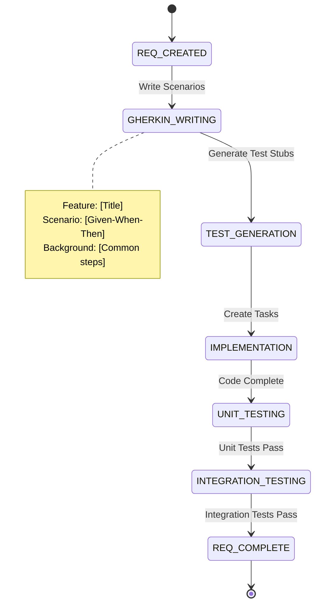

# Requirements Management

## 📝 **Requirement Workflow State Diagram**



## 🎯 **Gherkin-Based Specification System**

The Supernal Coding project uses **Gherkin syntax** for all requirement specifications to ensure clarity, testability, and automated validation.

### **Gherkin Template Structure**

```gherkin
Feature: [Requirement Title]
  As a [role]
  I want [goal/desire]
  So that [benefit/value]

  Background:
    Given [common precondition]
    And [additional setup]

  Scenario: [Primary Happy Path]
    Given [initial context]
    When [action occurs]
    Then [expected outcome]
    And [additional verification]

  Scenario: [Error Case]
    Given [error condition setup]
    When [action that triggers error]
    Then [error handling behavior]
    And [system state after error]

  Scenario Outline: [Data-Driven Test]
    Given [parameterized initial state]
    When [action with <parameter>]
    Then [expected <result>]

    Examples:
      | parameter | result |
      | value1    | result1|
      | value2    | result2|
```

### **CLI Commands for Requirements**

```bash
# Create new requirement
sc kanban new requirement "User Authentication" \
  --epic="auth-system" \
  --priority=high \
  --gherkin

# Generate Gherkin scenarios
sc generate gherkin REQ-001 --template=feature

# Validate Gherkin syntax
sc validate gherkin REQ-001 --strict

# Generate test stubs from Gherkin
sc test generate REQ-001 --from-gherkin
```

## 📋 **Requirement Lifecycle Phases**

### **REQ_CREATED**

**Purpose**: Initial requirement identification and basic documentation

**Activities**:

- Create requirement file with metadata
- Define basic scope and acceptance criteria
- Link to parent epic if applicable
- Assign initial priority

**File Structure**:

```
supernal-coding/requirements/
├── core/           # Core system requirements
├── infrastructure/ # Infrastructure requirements
├── workflow/       # Workflow requirements
└── validation/     # Validation requirements
```

**Metadata Template**:

```yaml
---
id: REQ-001
title: User Authentication
epic: auth-system
category: core
priority: Critical
status: Draft
dependencies: []
tags: ['security', 'authentication']
created: 2025-07-21
updated: 2025-07-21
---
```

### **GHERKIN_WRITING**

**Purpose**: Create detailed, testable scenarios using Gherkin syntax

**Best Practices**:

- **Feature Description**: Clear business value statement
- **Scenario Coverage**: Happy path, error cases, edge cases
- **Given-When-Then**: Precise, testable statements
- **Background**: Common setup for all scenarios
- **Examples**: Data-driven test cases where applicable

**Quality Checklist**:

- [ ] Feature title describes business value
- [ ] All scenarios are independently testable
- [ ] Given statements establish clear context
- [ ] When statements describe single actions
- [ ] Then statements verify observable outcomes
- [ ] Examples cover representative data ranges

### **TEST_GENERATION**

**Purpose**: Create automated test stubs from Gherkin scenarios

**Generated Test Structure**:

```
tests/requirements/req-001/
├── req-001.feature         # Original Gherkin
├── req-001.steps.js        # Step definitions
├── req-001.e2e.test.js     # End-to-end tests
└── req-001.validation.js   # Business logic validation
```

**CLI Commands**:

```bash
# Generate complete test suite
sc test scaffold REQ-001

# Generate specific test types
sc test scaffold REQ-001 --type=unit,integration,e2e

# Update tests when Gherkin changes
sc test update REQ-001 --sync-gherkin
```

### **IMPLEMENTATION**

**Purpose**: Break down requirement into implementable tasks

**Task Creation Process**:

1. **Analyze Scenarios**: Identify implementation steps for each scenario
2. **Create Tasks**: Generate specific development tasks
3. **Link Dependencies**: Establish task-to-task dependencies
4. **Estimate Effort**: Assign complexity and time estimates

**CLI Commands**:

```bash
# Generate tasks from requirement
sc kanban generate-tasks REQ-001 --auto-link

# Create manual task
sc kanban new todo "Implement user login validation" \
  --requirement="REQ-001" \
  --scenario="Login with valid credentials"

# View requirement progress
sc kanban progress REQ-001 --by-scenario
```

### **UNIT_TESTING**

**Purpose**: Validate individual components against requirement scenarios

**Testing Strategy**:

- **Component Tests**: Individual function/class validation
- **Integration Tests**: Cross-component interaction testing
- **Scenario Tests**: Direct Gherkin scenario validation
- **Regression Tests**: Ensure existing functionality preserved

**Test Execution**:

```bash
# Run requirement-specific tests
sc test run REQ-001 --coverage

# Run specific scenario tests
sc test run REQ-001 --scenario="Login with valid credentials"

# Generate coverage report
sc test coverage REQ-001 --format=html
```

### **INTEGRATION_TESTING**

**Purpose**: Validate requirement works with other system components

**Integration Scope**:

- **API Integration**: External service interactions
- **Database Integration**: Data persistence and retrieval
- **UI Integration**: User interface behavior validation
- **Cross-Requirement**: Dependencies between requirements

**CLI Commands**:

```bash
# Run integration test suite
sc test integration REQ-001

# Test requirement dependencies
sc test dependencies REQ-001 --validate-links

# Performance integration testing
sc test integration REQ-001 --performance --threshold=2000ms
```

### **REQ_COMPLETE**

**Purpose**: Requirement fully implemented, tested, and validated

**Completion Criteria**:

- [ ] All Gherkin scenarios pass automated tests
- [ ] Unit test coverage > 90%
- [ ] Integration tests pass
- [ ] Performance requirements met
- [ ] Security validation complete (if applicable)
- [ ] Documentation updated
- [ ] Code reviewed and approved

## 🔄 **Requirement Templates**

### **Feature Requirement Template**

```gherkin
Feature: [Business Capability]
  As a [user type]
  I want [goal]
  So that [business benefit]

  Background:
    Given the system is properly configured
    And all dependencies are available

  @critical
  Scenario: [Primary use case]
    Given [initial state]
    When [user action]
    Then [expected outcome]
    And [verification step]

  @error-handling
  Scenario: [Error case]
    Given [error condition]
    When [action triggering error]
    Then [error response]
    And [system stability]
```

### **Technical Requirement Template**

```gherkin
Feature: [Technical Capability]
  As a [developer/system]
  I want [technical goal]
  So that [technical benefit]

  @performance
  Scenario: [Performance requirement]
    Given [baseline conditions]
    When [load conditions applied]
    Then [performance threshold met]
    And [resource usage within limits]

  @security
  Scenario: [Security requirement]
    Given [security context]
    When [security test applied]
    Then [security requirement satisfied]
    And [no vulnerabilities detected]
```

## 📊 **Requirement Metrics**

### **Quality Metrics**

- **Scenario Coverage**: Percentage of requirement covered by scenarios
- **Test Coverage**: Percentage of scenarios with automated tests
- **Pass Rate**: Percentage of scenarios passing tests
- **Defect Density**: Issues found per requirement

### **Progress Metrics**

- **Implementation Progress**: Percentage of tasks completed
- **Test Progress**: Percentage of scenarios tested
- **Review Progress**: Percentage of scenarios reviewed
- **Approval Status**: Stakeholder approval state

### **Traceability Metrics**

- **Epic Linkage**: Requirements properly linked to epics
- **Task Linkage**: Tasks properly linked to requirements
- **Test Linkage**: Tests properly linked to scenarios
- **Git Linkage**: Commits properly linked to requirements

## 🚨 **Requirement Quality Assurance**

### **Gherkin Quality Rules**

- **Clarity**: Each scenario must be understandable by business stakeholders
- **Testability**: Each scenario must be automatically testable
- **Independence**: Scenarios must not depend on execution order
- **Completeness**: All acceptance criteria must be covered
- **Consistency**: Terminology consistent across scenarios

### **Validation Commands**

```bash
# Validate Gherkin syntax and quality
sc validate gherkin REQ-001 --quality-rules

# Check requirement completeness
sc validate requirement REQ-001 --completeness

# Verify traceability links
sc validate traceability REQ-001 --to-epic --to-tasks --to-tests

# Generate requirement quality report
sc report requirement-quality --epic=auth-system
```

### **Review Process**

1. **Technical Review**: Scenarios technically implementable
2. **Business Review**: Scenarios meet business needs
3. **Test Review**: Scenarios properly testable
4. **Security Review**: Security requirements addressed (if applicable)
5. **Performance Review**: Performance requirements specified (if applicable)

---

This requirements management system ensures that all functionality is clearly specified, testable, and traceable from business need through implementation to validation.
