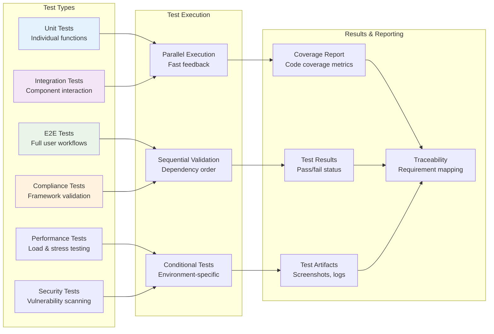

Visual representations of all Supernal Coding workflows using Mermaid diagrams.

## Complete Development Lifecycle

### End-to-End Project Flow

## Git Integration Workflows

### Smart Git Operations

### Branch Lifecycle Management

## Compliance Integration

### Multi-Framework Compliance Flow

## Testing Strategy Visualization

### Comprehensive Testing Pipeline

## Dashboard Interaction Patterns

### User Interaction Flow

### Responsive Design Flow

## Error Handling & Recovery

### Error Recovery Workflows

---

This comprehensive visual documentation provides clear understanding of all Supernal Coding workflows, making it easier for users to navigate and understand the system's capabilities.
